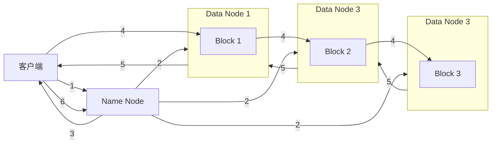
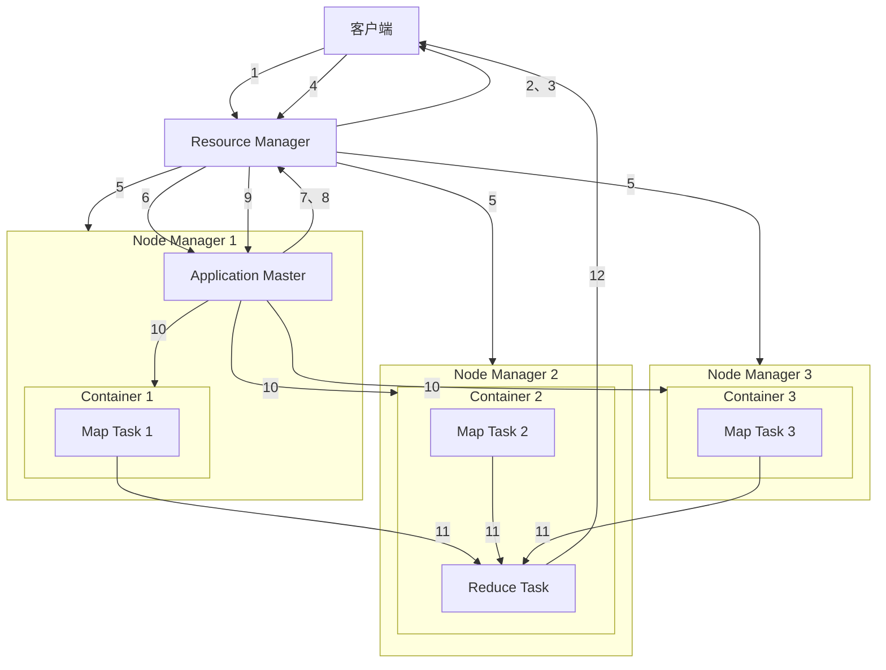

# Apache Hadoop

分布式系统基础架构

- 分布式
  - 单节点：存储空间有限，算力有限  
  - 分布式：将存储与计算分布在多个单节点中进行  
  - 多台服务器之间通过网络通信，对外提供不同服务

- 集群
  - 多台服务器之间通过网络通信，对外提供同一服务

- 负载均衡
  - 将计算与存储压力均衡分布在各服务器

- 并行
  - 并行：同时执行任务，任务**物理上同时执行**  
  - 并发：交替执行任务，任务**逻辑上同时推进**

## Hadoop特性

- 扩容能力 Scalable
  - Hadoop是在可用的计算机集群间分配数据并完成计算任务的，这些集群可用方便的扩展到数以千计的节点中。
- 经济性 Economical
  - Hadoop通过普通廉价的机器组成服务器集群来分发以及处理数据，以至于成本很低
- 高效率 Efficient
  - 通过并行数据，Hadoop可以在节点之间动态并行的移动数据，使得速度非常快。
- 可靠性 Reliable  
  - 能自动维护数据的多份复制，并且在任务失败后能自动地重新部署（redeploy）计算任务。

## Hadoop生态系统

**狭义上说，Hadoop是一款开源框架**，它的核心组件有：

- `HDFS` 分布式文件系统
  - 解决海量数据存储
- `YARN` 作业调度和集群资源管理的框架
  - 解决资源任务调度
- `MapReduce` 分布式运算编程框架
  - 解决海量数据计算

**广义上来说，Hadoop通常是指一个更广泛的概念：Hadoop生态圈**。

- 社区版
  - Apache Hadoop
- 商业版
  - cloudera：CDH
  - 星环科技：TDH
  - 阿里云：dataworks

## HDFS Hadoop Distributed File System

### 分块机制

HDFS中的文件在物理上是分块存储（Block）的，块的大小可以通过配置参数来规定，参数位于 `hdfs default.xml` 中的 `dfs.blocksize` 。默认大小是128M(134217728)。

压缩文件因为存在内部压缩算法而不会被分块，所以尽量不要上传压缩文件

### 副本机制

为了容错，文件的所有Block都会有副本。每个文件的Block大小 `dfs,blocksize` 和副本系数 `dfs. replication` 都是可配置的。

应用程序可以指定某个文件的副本数目。副本系数可以在文件创建的时候指定，也可以在之后通过命令改变。

默认 `dfs.replication` 的值是3，也就是会额外再复制2份，连同本身总共3份副本。

### 名称空间 `Namespace`

HDFS支持传统的层次型文件组织结构。用户可以创建目录，然后将文件保存在这些目录里。

文件系统名字空间的层次结构和大多数现有的文件系统类似：用户可以创建、删除、移动或重命名文件。

主节点 `NameNode` 负责维护文件系统的 `Namespace` 名称空间，任何对文件系统名称空间或属性的修改都将被 `NameNode` 记录下来。

HDFS会提供一个统一的逻辑目录，用于客户端对文件的访问

### 主节点 `NameNode`

负责管理文件系统、接受客户端消息请求、基于内存存储元数据信息 `Metadata` ，包括 `Namespace` 目录结构、文件块位置信息等。

### 从节点 `DataNode`

负责存储文件具体的数据块，`DataNode` 的数量决定了HDFS集群的整体数据存储能力，通过和 `NameNode` 配合维护着数据块。

### 主从架构 master/slave

​ 存在单点故障，多用于学习、测试环境，冷备份

- 主节点 `NameNode`
- 从节点 `datanode`
- `Secondary NameNode`

在磁盘中保存 `fsimage` 元数据持久化文件与 `editlog` 操作日志

### 主备架构

​ 高可用性架构,多用于生产环境，热备份

- 活跃主节点 `active namenode`
- 备用节点 `standby namenode`
- 从节点 `datanode`

活跃主节点出现故障时备用节点进行接替

使用 `Fencing` 机制在 `standby namenode` 启动时隔离之前的 `active namenode` ，避免脑裂问题

## HDFS读写流程

 `NameNode` 是访问HDFS的唯一入口

### 客户端写入数据

#### 写入数据流程

- 客户端写入请求
  - 客户端向 `NameNode` 发起文件写入请求（如 `hdfs dfs -put`）。
- `NameNode` 分配数据块与目标节点
    `NameNode` 根据**副本放置策略**选择一组 `DataNode`（默认3个），返回给客户端。
- 管道式写入（Pipeline Write）
  - 客户端将数据分成固定大小的**块（Block）**（默认128MB/256MB）。
  - 数据按顺序流式写入第一个 `DataNode` → 第一个节点接收后转发给第二个 → 依此类推，形成**写入管道**。
  - 每个 `DataNode` 接收数据后先写入本地磁盘，再转发到下一节点。
- 副本确认
  - 最后一个 `DataNode` 成功写入后，逐级向前返回确认信号，最终由客户端通知 `NameNode` 写入完成。



#### 副本放置策略

**关键！依赖机架感知**  

 `NameNode` 根据**机架感知（Rack Awareness）** 和以下规则放置副本（以默认3副本为例）：

1. **第一副本：**
    - 若客户端在集群内：优先放在**客户端所在节点**（避免跨网络传输）。
    - 若客户端在集群外：随机选择一个负载较低的节点。
2. **第二副本：**
    放置在与第一副本**不同机架（Different Rack）** 的随机节点（避免机架故障导致数据全丢）。
3. **第三副本：**
    放置在与**第二副本相同机架**的另一个节点（减少跨机架流量，同时保证同一机架内有2个副本）。

> - **容错性：** 跨机架放置（第一副本 vs 第二副本）防止机架级故障。
> - **读写效率：** 同机架内副本（第二与第三）便于快速读取和恢复。
> - **带宽优化：** 避免所有副本跨机架传输（仅第一副本到第二副本需跨机架）。

### 客户端读取数据

#### 读取数据流程

- **发起读请求**
    客户端传入文件路径（如 `/data/file.txt`）。

- **联系 `NameNode`**
  - 客户端向 **`NameNode`** 请求文件元数据：
    - 文件包含哪些 **Block**（如 Block A、B、C）
    - 每个Block的**副本位置**（存储该Block的 `DataNode` 列表）
- **`NameNode`  将以下信息返回给客户端**：
  - 文件长度
  - 组成文件的所有数据块列表
  - 对于每个数据块：
    - 块 ID (BlockID)
    - 块大小
    - 存储该块副本的 **`DataNode` 地址列表 (主机名/IP:端口)**，通常按**就近读取原则**排序（根据与**机架感知**与**网络拓扑**）
- **建立数据流**
  - 客户端直接联系最近的 `DataNode` （如优先选择同节点副本）
  - 按顺序读取Block：
    - 从第一个Block开始，**流式读取**（边传输边处理）
    - 读取完成后自动切换到下一个Block的最近 `DataNode`
- **数据校验与容错**
  - **校验和验证**：
    客户端验证接收数据的**校验和**（Checksum），与 `DataNode` 存储的校验和对比。
  - **故障处理**：
    - 若读取失败（如 `DataNode` 宕机），客户端自动切换至**同一Block的下一个副本**（如机架本地副本）
    - 向 `NameNode` 报告故障节点
- **关闭连接**
    客户端读取完所有Block后，关闭与 `DataNode` 的连接。

#### 数据读取优化策略

- **就近读取原则：**
    客户端向 `NameNode` 请求文件位置时，`NameNode` 按**网络拓扑排序**返回**距离最近**的副本列表：
    1. **节点本地（Local）：** 同一物理节点（最快）。
    2. **机架本地（Rack Local）：** 同一机架不同节点（较快）。
    3. **跨机架（Off-Rack）：** 其他机架节点（最慢）。
- **客户端选择：**
    客户端优先从最近的副本读取数据，减少网络延迟。

### HDFS操作

#### 语法结构

```shell
hdfs dfs [option]
```

大部分关键词与Linux一致，只需将关键词作为[option]加进hdfs语法中

### HDFS交互

#### 上传文件

```shell
hdfs dfs -put [option] <本地文件> <hdfs路径>  -- 将<本地文件>上传至<hdfs路径>
hdfs dfs -moveFromLocal [option] <本地文件> <hdfs路径>  -- 将<本地文件>移动至<hdfs路径>
hdfs dfs -copyFromLocal [option] <本地文件> <hdfs路径>  -- 将<本地文件>复制至<hdfs路径>
```

- `-f` 覆盖目标路径已有的相同文件
- `-p` 保留保留访问和修改时间、所有权和模式。

#### 下载文件

```shell
hdfs dfs -get [option] <hdfs文件> <本地路径>  -- 将<hdfs文件>下载至<本地路径>
hdfs dfs -copyToLocal [option] <hdfs文件> <本地路径>  -- 将<hdfs文件>复制至<本地路径>
```

- `-f` 覆盖目标路径已有的相同文件

#### 向文件追加内容

```shell
hdfs dfs -appendToFile <本地文件> <hdfs文件>  -- 将<本地文件>追加至<hdfs文件>尾部
```

不支持动态修改，只能追加文件

### 管理HDFS文件

#### 创建文件

```shell
hdfs dfs -touchz <目标路径> <文件名>  -- 在<目标路径>创建一个空文件<文件名>
```

#### 复制文件

```shell
hdfs dfs -cp <文件名> <目标路径>  -- 将<文件名>复制至<目标路径>
```

#### 移动文件

```shell
hdfs dfs -mv <文件名> <目标路径>/[<新文件名>]  -- 将<文件名>移动至<目标路径>[并重命名为<新文件名>]
```

#### 删除文件

```shell
hdfs dfs -rm [option] <文件名>
```

- `-r` 删除目录
- `-skipTraeh` 不将目标放入回收站，直接删除，慎用

#### 查看文件尾部

```shell
hdfs dfs -tail [option] <文件名>
```

- `-f` 实时监控文件变化

#### 统计文件大小

```shell
hdfs dfs -du [option] <目标路径>
```

- `-h` 以高可读方式展示

#### 查看磁盘使用情况

```shell
hdfs dfs -df [option]
```

- `-h` 以高可读方式展示

```shell
hadoop archive -archiveName <文件名.har> -p <文件路径> <目标路径>
```

将 `<文件路径>` 下的所有文件存档进 `<文件名.har>` ，并保存在 `<目标路径>` 。

## MapReduce

分布式计算编程模型（框架），**中心思想是微积分**，可以使用其他计算框架替代（Tez、Spark、Flink）

### MapReduce运算流程

#### Map Task

将 DataNode 中本地存储的数据通过 Split 切片，切分数据并启动 Map Task 实现本地计算

每个 Map Task 处理一个 Split 切片，逐行读取数据

1. 读取输入：将读取的数据解析为**键值对{Key-Value}**
2. 执行 Map 函数：通过自定义 `map()` 函数转换转换生成若干**中间键值对**
3. 输出：将中间键值对输出到内存缓存区
4. 分区：根据 Hash 值将 Map 输出的**中间键值对**分配到不同 Reduce 分区，确保相同键的记录最终会被发送到同一个 Reduce Task
5. 排序：对内存中属于同一个 Reduce 分区的数据进行**排序**
6. 溢写：当 Map 输出缓存区到达阈值（默认80%）时，将数据写入本地磁盘的临时文件
7. 合并：将多个溢写的临时文件合并成一个**分区内有序**的大文件
8. Map Task 完成：文件输出在运行 Map Task 的本地磁盘上

#### Shuffle

通过网络接收 Map Task 结果

1. 拉取数据：当一个 Map Task 完成时，每个 Reduce Task 启动多个复制线程
2. 这些线程**主动**从各个**已完成 Map Task** 的节点的本地磁盘上拉取**属于自己分区**的中间键值对
3. 拉取到的**中间键值对**缓存在 Reduce Task 所在节点的内存中，内存不足时溢写到本地磁盘

#### Reduce Task

1. 对拉取到的所有中间键值对按**键**进行多轮归并排序，使得**相同键的所有值被分组到一起**
2. 执行 Reduce 函数：对于排序后的**中间键值对**中的每一个唯一的键将**该键及其对应的所有值**输入用户编写的 `reduce()` 函数
3. `reduce()` 函数对这个键及其值列表进行处理，输出零个、一个或多个**最终结果键值对**
4. 输出：Reduce Task 使用指定的输出格式将 `reduce()` 函数输出的**最终键值对**写入指定的输出位置

## YARN

### `ResourceManager`

1. 处理客户端请求
2. 资源分配调度
3. 管理从节点和任务进程

### `NodeManager`

1. 管理单个节点的资源
2. 处理来自 `ResourceManager` 的命令
3. 处理来自 `ApplicationMaster` 的命令

### `ApplicationMaster`

1. 为应用程序申请资源并分配内部任务
2. 监控任务与容错

### `Container`

是YARN中的资源抽象，封装了某个节点的多维度资源，包括CPU、内存、磁盘、网络等等

### YARN执行流程

 `ResourceManager` 是访问YARN的唯一入口

1. 客户端提交任务，向 `RM` 申请 `Application ID`
2. `RM` 返回作业资源（JAR包、配置文件等）在 **HDFS** 的暂存目录
3. `ResourceManager` 返回**HDFS** 上的作业资源（JAR包、配置文件等）暂存路径
4. 客户端上传任务所需资源并提交正式的**应用提交请求**
5. `RM` 根据所需资源创建选择 `NM` 创建 `Container` 并运行 `AM`
6. `NM` 下载 `AM` 所需资源并启动 `AM` 进程
7. `AM` 向 `RM` 注册自己，建立心跳
8. `AM` 根据任务需求，向 `RM` 发送资源请求，包含需要的 **`Container` 数量**、每个 `Container` 的**资源规格**、**数据本地化要求**
9. `RM` 根据集群中所有 `NM` 的心跳，在 `NM` 上分配 `Container` ，并通过心跳返回  `AM`
10. `AM` 与对应的 `NM` 通信，发送需要在 `Container` 内运行的具体任务



#### 关键顺序要点总结

- **提交与初始化：** 客户端提交 (1) -> RM 调度启动 AM 容器 (2) -> NM 启动 AM (3)。
- **AM 主导阶段：** AM 注册 (4) -> AM 申请资源 (5) -> RM 分配资源 (6) -> AM 启动任务 (7) -> NM 运行任务 (8)。
- **执行与监控：** 任务运行 (8) 与 AM 监控/容错 (9) **并行发生**，贯穿任务执行期。
- **结束与清理：** 所有任务成功 -> AM 注销 (10) -> RM/NM 清理 -> 客户端获取结果 (11)。
