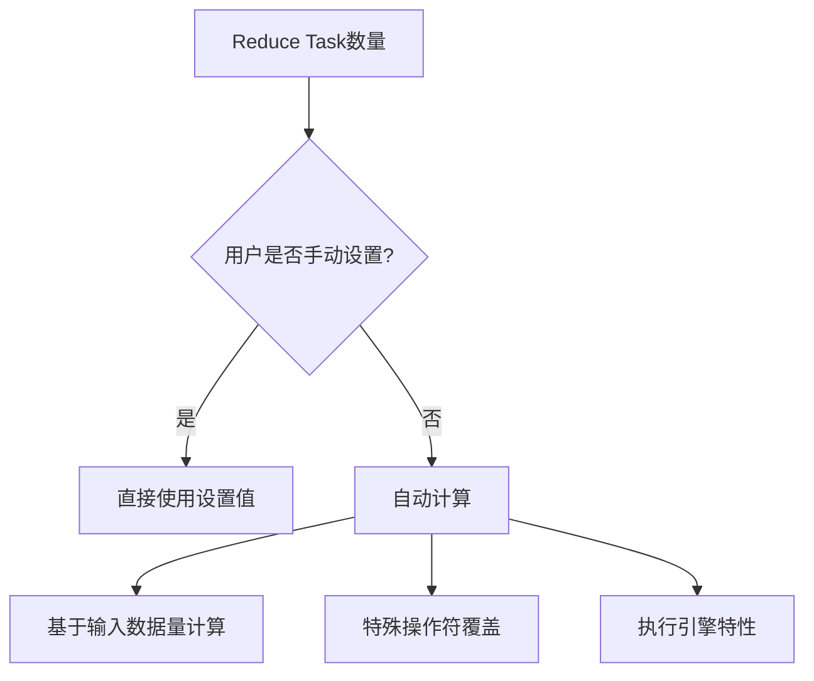
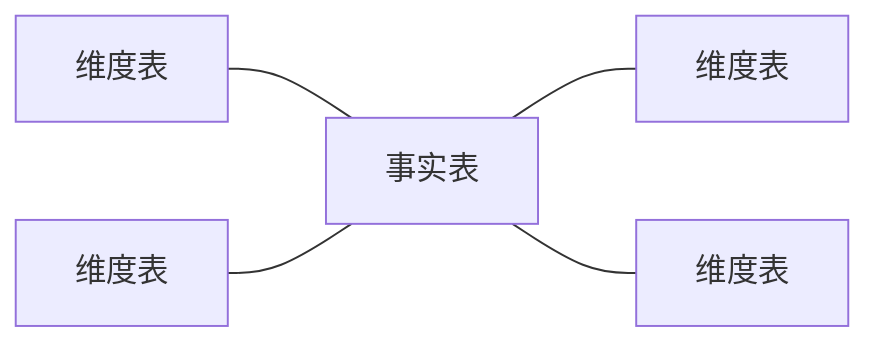
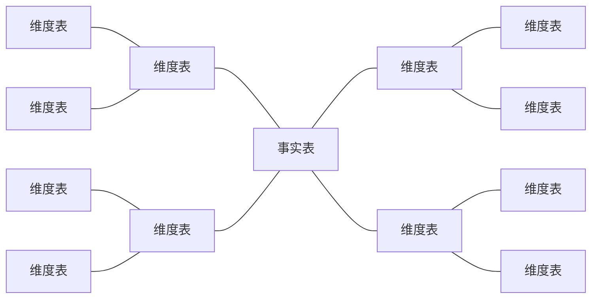
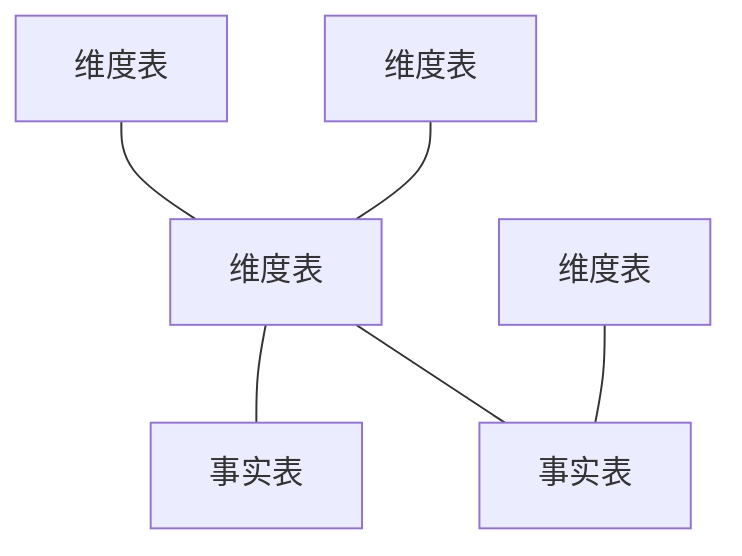
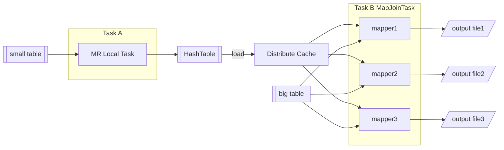

# Apache Hive

Apache Hive是建立在Hadoop至上的开源数据仓库系统，可以将存储在Hadoop中的结构化、半结构化数据文件映射为数据库表，并提供类似`SQL`的查询模型，称为Hive查询语言`HQL`。  
Hive的核心是将`HQL`转换为`MapReduce`进程并提交到Hadoop集群执行。

## 功能实现关键

### 映射信息记录

Hive通过内置的Derby或外部数据库存储Hadoop集群中数据文件的元数据，使用`metaserver`进行管理。  
HQL的DDL与DML本质上是修改元数据。  
直接通过HDFS操作Hive表路径不会影响元数据。

### Hive读写文件机制

- 读取文件
  - 首先调用InputFormat(默认TextInputFormat)，返回一条一条kv键值对记录（默认是一行对应一条记录）
  - 然后调用SerDe(默认LazySimpleSerDe)的Deserializer，将一条记录中的value根据分隔符切分为各个字段
  - HDFS files --> InputFormat --> <key,value> --> Deserializer --> Row object
- 写文件机制
  - 首先调用SerDe(默认LazySimpleSerDe)的Serializer将对象转换成字节序列
  - 然后调用OutputFormat将数据写入HDFS文件中
  - Row object --> Serializer --> <key,value> --> OutputFormat --> HDFS files

## 文件存储格式

Hive存储数据的本质是HDFS，所有的读写都基于对HDFS中的文件进行操作来实现。  
为了提高对HDFS文件读写的性能，Hive提供了多种文件存储格式。

> TextFile  （行式存储）  
> SequenceFile  （行式存储）  
> ORC  （列式存储）  
> Parquet  （行式存储）

### 行式存储与列式存储

- 行式存储
  - 将同一行的所有列的数据紧密地存储在一起（通常在一个数据页或连续的磁盘块中）
  - 优化整行数据的读写操作（尤其是插入、更新、删除和基于行的查询）
- 列式存储
  - 将同一列的所有行的数据紧密地存储在一起（每个列存储在独立的文件或文件块中）
  - 优化对特定列的聚合、分析查询（只读取查询涉及的列）

表：

||a|b|c|
|-|-|-|-|
|1|a1|b1|c1|
|2|a2|b2|c2|
|3|a3|b3|c3|

|||||||||||
|-|-|-|-|-|-|-|-|-|-|
| 行式存储 | a1 | b1 | c1 | a2 | b2 | c2 | a3 | b3 | c3 |
| 列式存储 | a1 | a2 | a3 | b1 | b2 | b3 | c1 | c2 | c3 |

**优点比较**：

| 特性 | 行式存储 | 列式存储 |
| - | - | - |
| 写入性能 | 优：插入、更新、删除单条记录非常高效，因为只需写入/修改一个物理位置的数据块 | 劣：插入/更新/删除一条记录需要修改多个列文件（每个列一个），开销大。写入通常采用批量追加方式优化 |
| 点查询/整行读取 | 优：根据主键或索引快速定位到行所在的数据块，一次性读取整行所有列非常快 | 劣：需要从多个不同的列文件中分别读取所需列的数据，然后拼装成行，I/O次数多，延迟较高 |
| 分析查询 （聚合、扫描） | 劣：即使查询只涉及少数几列，也必须读取整行数据（包含不需要的列），导致I/O浪费和带宽瓶颈 | 优：核心优势！ 只需读取查询涉及的列文件。跳过无关列，极大减少I/O数据量。特别适合SELECT col1, col2, SUM(col3) FROM table WHERE col4 > N GROUP BY col1这类查询 |
| 数据压缩效率 | 中：压缩效率一般。同一行内不同列的数据类型差异大，压缩算法难以找到长重复模式 | 优：核心优势！ 同一列内数据类型高度一致，值范围小且重复性高（尤其是枚举、状态、日期等），利于高效压缩（如行程编码、字典编码、位图编码）。压缩比通常远高于行存，节省存储空间和I/O带宽 |
| 适合场景 | OLTP：在线事务处理（银行交易、订单录入、用户资料更新）。需要频繁写入、点查询、事务支持 | OLAP：在线分析处理（数据仓库、商业智能、大数据分析）。以读为主，涉及大量数据扫描、聚合计算、只查询部分列 |
| 索引依赖 | 高：依赖索引（B树等）来加速点查询和范围查询 | 低：列式结构本身对聚合和过滤就有优势。通常使用轻量级索引（如Zone Maps、Bitmap Indexes）或利用列数据有序性 |
| CPU缓存利用率 | 中：读取整行时，如果行宽不大，缓存利用率尚可。但可能加载不必要的数据 | 优：只加载查询需要的列数据，这些数据在内存中是连续的，非常适合现代CPU的向量化处理，极大提升扫描和计算效率 |
| 复杂查询优化 | 中：优化器需要考虑行扫描开销 | 优：更容易进行谓词下推、列裁剪等优化，减少数据移动和计算量 |
| 存储空间 | 中/高：相对列存占用空间通常更大 | 低：高压缩率显著节省存储空间 |
| 模式演化 | 中：添加列通常较简单（在行尾添加），删除列可能需标记或重建表 | 复杂：添加列只需新建一个列文件，相对简单。但删除列或修改列类型可能需要重组所有数据文件，代价较高 |

- 选择行式存储当：
  - 主要负载是频繁的在线事务处理 `OLTP`。
  - 查询通常是基于主键或索引的点查询或范围查询，并且需要返回整行或大部分列。
  - 应用需要高吞吐、低延迟的写入和更新。
  - 典型场景：核心业务系统(ERP, CRM)、电子商务订单系统、银行交易系统。
- 选择列式存储当：
  - 主要负载是数据分析和报表 `OLAP`。
  - 查询通常只涉及表中的少数几列，并进行大量的聚合计算。
  - 数据集非常大，I/O效率和存储成本是关键考量。
  - 数据写入主要是批量加载，对实时性要求不高。
  - 典型场景：数据仓库、商业智能平台、大数据分析平台、日志分析系统。

### TXTFILE

纯文本文件存储格式，数据不做压缩，也是hive的默认存储格式，磁盘开销大，数据解析开销大。

### ORC Optimized Row Columnar

ORC文件格式是一种Hadoop生态圈中的列式存储格式，用于降低Hadoop数据存储空间和加速Hive查询速度。
ORC并不是一个单纯的列式存储格式，仍然是首先根据行组分割整个表，在每一个行组内进行按列存储。  
ORC文件是以二进制方式存储的，所以是不可以直接读取，ORC文件是自解析的

优点如下：
ORC是列式存储，有多种文件压缩方式并具有高压缩比。
文件可切分(Split)，节省HDFS存储资源，查询任务的输入数据量减少，使用的MapTask也减少。
ORC可以支持复杂的数据结构（比如Map等）。

一个orc文件可以分为若干个Stripe，一个stripe可以分为三个部分：

> IndexData：某些列的索引数据  
> RowData：真正的数据存储  
> StripFooter：stripe的元数据信息

Index Data：  
一个轻量级的index，默认每隔1W行做一个索引。  
只记录某行的各字段在Row Data中的偏移量(offset)。

Row Data：  
存的是具体的数据，先取部分行，然后对这些行按列进行存储。  
对每个列进行了编码，分成多个Stream来存储。

Stripe Footer：  
存的是各个stripe的元数据信息。  
每个文件有一个File Footer，存储每个Stripe的行数、每个Column的数据类型信息等；  
每个文件的尾部是一个PostScript，记录文件的压缩类型以及FileFooter的长度信息等。

在读取ORC文件时，会seek到文件尾部读PostScript，从里面解析到File Footer长度，再读FileFooter，从里面解析到各个Stripe信息，再读各个Stripe，即从后往前读。

### PARQUET

Parquet是一种支持嵌套结构的列式存储文件格式。
Parquet文件以二进制方式存储，不可以直接读取，文件中包括该文件的数据和元数据，因此Parquet格式文件是自解析的。
通常情况下，在存储Parquet数据的时候会按照Block大小设置行组的大小，由于一般情况下每一个Mapper任务处理数据的最小单位是一个Block，这样可以把每一个行组由一个Mapper任务处理，增大任务执行并行度。

## 数据类型

- Hive对于英文字母大小写不敏感
- 除SQL数据类型外，还支持Java数据类型，比如：string
- 复杂数据类型的使用通常需要和分隔符指定语法配合使用

### 原生数据类型

- 数值类型
  - TINYINT
  - SMALLINT
  - **INT**
  - BIGINT
  - FLOAT
  - **DOUBLE**
  - DECIMAL
  - NUMERIC
- 时间类型
  - **TIMESTAMP**
  - **DATE**
  - INTERVAL
- 字符串类型
  - **STRING**
  - VARCHAR
  - CHAR
- 杂项数据类型
  - BOOLEAN
  - BINARY

原生数据类型支持从窄类型到宽类型的隐式转换

### 复杂数据类型

**`ARRAY <type>`**

**`MAP <key_type, value_type>`**

`STRUCT <name_1, type_1, name_2, type_2, ...>`

`UNION <type, type, ...>`

| 特性 | ARRAY | MAP | STRUCT | UNIONTYPE |
| - | - | - | - | - |
| 本质 | 有序的同类型元素列表 | 键值对集合（键基本类型/唯一） | 命名字段的集合（字段名/类型） | 值可以是多个指定类型之一（当前仅一种） |
| 访问方式 | 整数索引[0], [1], ... | 键(Key) ['key'] | 字段名(Field Name).fieldname | 函数(create_union, uniontype_tag, uniontype_value, uniontype_get) |
| 元素要求 | 所有元素类型相同 | 键类型相同（基本类型），值类型相同 | 字段类型可不同，名称必须唯一 | 值必须是声明中某一种类型 |
| 顺序 | 有（索引顺序） | 无（但迭代顺序可能确定） | 无（按字段名访问） | - |
| 键/字段 | 无 | 键(Key) | 字段(Field) | - |
| 典型用途 | 列表、序列、重复项集合（标签、电话号码） | 属性字典、键值配置、稀疏向量 | 组合相关属性（地址、坐标点、用户对象） | 模式演化、处理字段类型可能不同的稀疏数据 |
| 声明示例 | ARRAY\<STRING> | MAP<STRING, INT> | STRUCT<street: STRING, city: STRING, zip: INT> | UNIONTYPE<INT, FLOAT, STRING> |
| 值示例 | ['apple', 'banana', 'orange'] | {'color': 'red', 'size': 10} | {'street': 'Main St', 'city': 'Anytown', 'zip': 12345} | create_union(0, 42)(INT 42) 或 create_union(2, "error")(STRING "error") |

复杂数据类型可以结合使用

`STRUCT<name, STRUCT<name, type>>`

## 运算符

### 关系运算符

| 符号 | 功能 |
| - | - |
| `=` `==` | 等值比较 |
| `<>` `!=` | 不等值比较 |
| `<` | 小于比较 |
| `<=` | 小于等于比较 |
| `>` | 大于比较 |
| `>=` | 大于等于比较 |
| `IS NULL` | 空值判断 |
| `IS NOT NULL` | 非空判断 |
| `LIKE` | LIKE比较 |
| `RLIKE` | JAVA的LIKE操作 |
| `REGEXP` | REGEXP操作 |

### 算术运算符

| 符号 | 功能 |
| - | - |
| `+` | 加法 |
| `-` | 减法 |
| `*` | 乘法 |
| `/` | 除法 |
| `div` | 取整 |
| `%` | 取余 |
| `&` | 位与 |
| `\|` | 位或 |
| `^` | 位异或 |
| `~` | 位取反 |

### 逻辑运算符

| 符号 | 功能 |
| - | - |
| `AND` | 与 |
| `OR` | 或 |
| `NOT` | 非 |
| `IN` | 在 |
| `NOT IN` | 不在 |
| `EXISTS` | 存在 |
| `NOT EXISTS` | 不存在 |

### Hive 正则表达式

| 功能 | Hive | Linux BRE | Linux ERE | PCRE |
| - | :-: | :-: | :-: | :-: |
| 基本匹配 | ✓ | ✓ | ✓ | ✓ |
| 量词 `{n,m}` | ✓ | 需转义 | ✓ | ✓ |
| 或操作 `\|` | ✓ | ✗ | ✓ | ✓ |
| 分组 `()` | ✓ | 需转义 | ✓ | ✓ |
| 预定义字符类 `\d` | ✓ | ✗ | ✗ | ✓ |
| 单词边界 `\b` | ✓ | ✗ | ✗ | ✓ |
| 非贪婪匹配 `*?` | ✓ | ✗ | ✗ | ✓ |
| 回溯引用 `\1` | ✓ | ✓ | ✓ | ✓|
| 前瞻后顾 | ✓ | ✗ |  | ✓ |
| 命名分组 | ✓ | ✗ | ✗ | ✓ |

- 在Hive中：
  - **始终使用双反斜杠转义**
  - 利用Java正则的高级特性
  - 测试时使用在线Java正则测试工具
- 在Linux中：
  - 明确工具使用的标准：
    - grep 默认BRE
    - grep -E 使用ERE
    - grep -P 使用PCRE
  - 优先使用POSIX字符类增强可移植性
  - 对于复杂需求，考虑使用Python脚本

## 函数

根据输入和输出的参数数量可以分为三类：

- 普通函数
  - 一进一出
- 聚合函数 User-Defined Aggregation Function
  - 多进一出
- 表生成函数 User-Defined Table-Generating Function
  - 一进多出

```sql
-- 查看函数
SHOW FUNCTIONS;
DESCRIBE FUNCTION EXTENED <function>;
```

### 普通函数

#### 数学函数

| 函数名 | 描述 |
| - | - |
| rand() | 返回 0 到 1 之间的随机数（每次调用结果不同） |
| round(x[, d]) | 四舍五入到指定小数位（默认 0 位） |
| mod(x,y) | 返回 x 除以 y 的余数（等同于 %） |
| pow(x,y) | 计算 x 的 y 次幂 |
| floor(x) | 向下取整（返回小于等于 x的最大整数） |
| ceil(x) | 向上取整（返回大于等于 x的最小整数） |
| abs(x) | 返回 x 的绝对值 |

#### 字符串函数

| 函数名 | 描述 | 示例 | 结果 |
| - | - | - | - |
| length(str) | 返回字符串的字符数 | length('Hello') | 5 |
| empty(str) | 判断字符串是否为空（长度为0） | empty('') | true |
| substr(str, start[, length]) | 从指定下标开始截取字符串（下标从1开始） | substr('Hello', 2, 3) | ell |
| concat(str1, str2, ...) | 连接多个字符串，受空值影响 | concat('Hello',' ', 'World'); | Hello World |
| concat_ws(sep, str1, str2,...) | 使用分隔符连接多个字符串，不受空值影响 | concat_ws('-','a','b','c'); | a-b-c |
| upper(str) | 将字符串转换为大写 | upper('hello'); | HELLO |
| lower(str) | 将字符串转换为小写 | lower('WORLD'); | world |
| instr(str, substr) | 返回子串第一次出现的位置（从1 开始） | instr('Hello','l'); | 3 |
| split(str, regex) | 将字符串按正则表达式分割为数组 | split('a,b,c',','); | ["a","b","c"] |
| translate(str, from_str, to_str) | 字符替换（按位置映射） | translate('abcxyz', 'abc','123'); | 123xyz |
| regexp_replace(str, pattern, replacement) | 使用正则表达式替换匹配的子串 | regexp_replace('a1b2c', '\\d','X'); | aXbXc |

#### 日期函数

| 函数名 | 描述 | 示例 | 结果 |
| - | - | - | - |
| current_date() | 返回当前日期（DATE 类型） | current_date() | 2025-05-27 |
| current_timestamp() | 返回当前时间戳（TIMESTAMP 类型） | current_timestamp() | 2025-05-2712:34:56.789 |
| unix_timestamp() | 返回当前Unix 时间戳（整数，秒级） | unix_timestamp() | 1748354096 |
| year([date\|timestamp]) | 返回年份 | year('2025-05-27') | 2025 |
| month([date\|timestamp]) | 返回月份（1-12） | month('2025-05-27') | 5 |
| day([date\|timestamp]) | 返回日期（1-31） | day('2025-05-27') | 27 |
| hour(timestamp) | 返回小时（0-23） | hour('2025-05-2712:34:56') | 12 |
| minute(timestamp) | 返回分钟（0-59） | minute('2025-05-27 12:34:56') | 34 |
| second(timestamp) | 返回秒（0-59） | second('2025-05-27 12:34:56') | 56 |
| date_add(date, n) | 日期加 n 天 | date_add('2025-05-27', 3) | 2025-05-30 |
| date_sub(date, n) | 日期减 n 天 | date_sub('2025-05-27', 3) | 2025-05-24 |
| add_months(date, n) | 日期加 n 个月 | add_months('2025-05-27', 1) | 2025-06-27 |
| months_between(date1,date2) | 计算两个日期相差的月数 | months_between('2025-06-01','2025-05-01') | 1.0 |
| datediff(enddate,startdate) | 计算两个日期相差的天数 | datediff('2025-05-30', '2025-05-27') | 3 |
| from_unixtime(unix_timestamp, format) | 将 Unix 时间戳转换为字符串 | from_unixtime(1748323200) | 2025-05-2700:00:00 |
| date_format([date\|timestamp], format) | 按指定格式格式化日期 | date_format('2025-05-27', 'yyyy-MM-dd') | 2025-05-27 |
| to_date([timestamp\|strin]g) | 将时间戳或字符串转为DATE 类型 | to_date('2025-05-27 12:34:56') | 2025-05-27 |
| trunc(date, format) | 按指定单位截断日期（如月份、季度） | trunc('2025-05-27', 'MM') | 2025-05-01 |

#### 类型转换函数

`CAST(expr AS type)`

**关键注意事项**：

- 范围与精度
  - 大范围类型 → 小范围类型（如 BIGINT → INT）可能溢出，结果为 NULL
  - 浮点类型转整数类型时直接截断小数（不四舍五入）
  - DECIMAL 转其他数值类型时，超出目标精度/范围会返回 NULL
- 字符串解析
  - 字符串转数字/时间时，格式无效则返回 NULL
  - 布尔字符串仅识别 "true"/"false"（不区分大小写）
- 时间类型
  - TIMESTAMP ↔ DATE 转换会丢弃或补足时间部分
  - 字符串转时间需严格匹配格式（可通过 CAST(x AS STRING) 验证格式）
- 隐式转换
  - Hive 在某些场景（如比较、表达式计算）会自动进行类型转换，规则可能与 CAST 不同

| 源数据类型 | 目标数据类型 | 是否支持 | 说明与注意事项 |
| - | - | - | - |
| TINYINT | BOOLEAN | 是 | 非0值 → true；0 → false |
| | SMALLINT | 是 | 直接转换 |
| | INT | 是 | 直接转换 |
| | BIGINT | 是 | 直接转换 |
| | FLOAT | 是 | 可能损失精度 |
| | DOUBLE | 是 | 可能损失精度 |
| | DECIMAL | 是 | 保留精确值 |
| | STRING | 是 | 转换为数字字符串 |
| | VARCHAR | 是 | 同 STRING |
| | CHAR | 是 | 同 STRING |
| | TIMESTAMP | 否 | 不支持直接转换 |
| | DATE | 否 | 不支持 |
| | BINARY | 否 | 不支持 |
| SMALLINT | ... | 是 | 类似 TINYINT 规则（支持数值/STRING/VARCHAR/CHAR/DECIMAL） |
| INT | ... | 是 | 类似 TINYINT 规则 |
| BIGINT | ... | 是 | 类似 TINYINT 规则；转 FLOAT/DOUBLE 时精度损失风险更高 |
| FLOAT | BOOLEAN | 是 | 非0.0 → true；0.0 → false |
| | TINYINT | 是 | 小数部分截断（不四舍五入） |
| | SMALLINT | 是 | 小数部分截断 |
| | INT | 是 | 小数部分截断 |
| | BIGINT | 是 | 小数部分截断 |
| | DOUBLE | 是 | 可能损失精度 |
| | DECIMAL | 是 | 可能损失精度（DECIMAL 精度有限） |
| | STRING | 是 | 转换为科学计数法或数字字符串 |
| DOUBLE | ... | 是 | 类似 FLOAT 规则；精度损失风险更高 |
| DECIMAL | BOOLEAN | 是 | 非0 → true；0 → false |
| | TINYINT | 是 | 小数部分截断（若超出目标范围返回 NULL） |
| | FLOAT/DOUBLE | 是 | 可能损失精度和范围 |
| | STRING | 是 | 精确数字字符串 |
| BOOLEAN | TINYINT | 是 | true → 1；false → 0 |
| | STRING | 是 | true → "true"；false → "false" |
| STRING / VARCHAR / CHAR | BOOLEAN | 是 | "true" → true；"false" → false（不区分大小写）；其他字符串 → NULL |
| | TINYINT | 是 | 需为有效整数字符串（否则 NULL） |
| | FLOAT/DOUBLE | 是 | 需为有效数字字符串（否则 NULL） |
| | DECIMAL | 是 | 需为有效数字字符串（否则 NULL） |
| | TIMESTAMP | 是 | 需匹配格式（如 "yyyy-MM-dd HH:mm:ss"），失败则 NULL |
| | DATE | 是 | 需匹配格式（如 "yyyy-MM-dd"），失败则 NULL |
| | BINARY | 是 | 将字符串转为二进制表示 |
| TIMESTAMP | STRING | 是 | 默认格式转为字符串 |
| | VARCHAR | 是 | 同 STRING |
| | CHAR | 是 | 同 STRING |
| | DATE | 是 | 丢弃时间部分，保留日期 |
| | BIGINT | 是 | 转为 Unix 时间戳（毫秒） |
| DATE | STRING | 是 | 默认格式转为字符串 |
| | TIMESTAMP | 是 | 时间部分补零（00:00:00） |
| BINARY | STRING | 是 | 按 UTF-8 解析（可能乱码） |

### 聚合函数

`sum()`
求和  
`count()`
计数  
`avg()`
平均值  
`max()`
最大  
`min()`
最小  
`collect_list()`
查询字段中所有值不去重  
`collect_set()`
查询字段中所有值并去重


### 表生成函数

生成一张虚拟表，其结果不能直接使用`SELECT`和一般字段一起查询，需要结合侧视图使用

| 函数 | 输入类型 | 输出 |
| - | - | - |
| explode() | array\<T> | 单列多行 |
| explode() | map<K,V> | 两列多行（key/value） |
| posexplode() | array\<T> | 两列多行（位置/值） |
| inline() | array\<struct> | 多列多行（结构体字段） |
| json_tuple() | JSON字符串 | 多列单行 |
| parse_url_tuple() | URL字符串 | 多列单行 |
| stack() | 常量值 | 多列多行 |

#### `EXPLODE`

将`array()`数据类型中的每个元素生成为一行

表Sample:

| ID | array |
| - | - |
| 1 | ["A","B","C"] |

```sql
SELECT explode(array)
FROM Sample;
```

结果：

| col |
| - |
| A |
| B |
| C |

将`map()`数据类型中的每对映射生成为一行，键与值分为两列

表Sample:

| ID | map |
| - | - |
| 1 | (["K_1","V_1"] ["K_2","V_2"]) |

```sql
SELECT explode(map)
FROM Sample;
```

结果：

| col | col |
| - | - |
| K_1 | V_1 |
| K_2 | V_2 |

### 侧视图 Lateral View

```sql
SELECT
  <table>.<column>,
  ...
  <alisa_UDTF>.<alias_1>,
  ...
FROM <table>
LATERAL VIEW <UDTF()> <alisa_UDTF> AS <alias_1>, ...;
```

`LATERAL VIEW <UDTF()> <alisa_UDTF> AS <alias_1>, ...`  
将<UDTF()>的结果命名为<alisa_UDTF>，并将其中的字段命名为<alias_1>, ...

- 别名要求：
  - 必须为虚拟表指定别名
  - 必须为 UDTF 生成的每一列指定别名
- 性能考虑：
  - 避免在大型数据集上使用多个 LATERAL VIEW
  - 使用 WHERE 子句在展开前过滤数据

## Hive DDL

### 数据库

**创建数据库**  

```sql
CREATE [DATABASE|SCHEMA] [IF NOT EXISTS] <database>
[COMMENT '<comment>']
LOCATION '</HDFS_path>'
[WITH DBPROPERTIES ('<property>'='<value>', ...)];
```

**查看数据库结构**  

```sql
DESCRIBE DATABASE [EXTENDED] <database>;
```

**查看数据库建库语句**  

```sql
SHOW CREATE DATABASE <database>;
```

**切换数据库**  

```sql
USE <database>;
```

**删除数据库**  

```sql
DROP DATABASE <database> [RESTRICT|CASCADE];  -- 默认RESTRICT只能删除空库,CASCADE用于强制删除
```

**修改数据库属性**  

```sql
ALTER DATABASE <database> SET DBPROPERTIES ('<property>'='<value>', ...);
ALTER DATABASE <database> SET OWNER [USER|ROLE] <account_type>;
ALTER DATABASE <database> SET LOCATION '</HDFS_path>';
```

**查询所有数据库**  

```sql
SHOW DATABASES;
SHOW SCHEMAS;
```

**查看当前数据库**  

```sql
SELECT current_database();
```

### 表

**完整建表语句**  

```sql
CREATE [TEMPORARY] [EXTERNAL] TABLE [IF NOT EXISTS] [<database>.]table (
  <column_1> <type_1> [COMMENT <comment_1>],
  <column_2> <type_2> [COMMENT <comment_2>],
  ...
) [COMMENT <comment>]
[PARYTITIONED BY (<column> <type> [COMMENT <comment>], ...)]
[CLUSTERED BY (<column_1>, <column_2>, ...) [SORTED BY (<column>) [ASC|DESC], ...] INTO <num_buckets> BUCKETS]
[ROW FORMAT [DELIMITED
[FIELDS TERMINATED BY '<separator>']
[COLLECTION ITEMS TERMINATED BY '<separator>']
[MAP KEYS TERMINATED BY '<separator>']
[LINES TERMINATED BY '<separator>']
|SERDE <serde>
[WITH SERDEPROPERTIES (<property>=<value>, ...)]]]
[STORED AS <file_format>]
[LOCATION </HDFS_path>]
[TBLPROPERTIES ('<property>'='<value>', ...)];
```

**复制表[数据|结构]**

```sql
CREATE TABLE <table_target> AS
SELECT *
FROM <table_source>;

CREATE TABLE <table_target>  LIKE
SELECT *
FROM <table_source>;
```

**查看表元数据**  

```sql
DESCRIBE [EXTENED] <table>;
DESCRIBE FORMATTED <table>;
```

**删除表**  

```sql
DROP TABLE [IF EXISTS] <table> [PURGE];
TRUNCATE [TABLE] <table>;
```

- `DROP`
  - 删除元数据和数据，实际上是将该表数据文件移入垃圾桶目录，只删除元数据
  - 删除EXTERNAL表时，该表的数据文件不会从HDFS中删除，只删除元数据
  - 如果指定了`PURGE`则数据不会进入垃圾桶目录直接被删除，无法找回表数据
- `TRUNCATE`
  - 只删除数据文件，保留表的元数据结构
  - 如果HDFS启用了垃圾桶，数据将被移入垃圾桶，否则将被删除

**修改表**  

```sql
-- 更改表名
ALTER TABLE <table_name> RENAME TO <new_table_name>;

-- 更改表属性
ALTER TABLE <table> SET TBLPROPERTIES (property_name = property_value, ... );

-- 更改表注释
ALTER TABLE <table> SET TBLPROPERTIES ('comment' = "new comment for student table");

-- 更改SerDe属性
ALTER TABLE <table> SET SERDE serde_class_name [WITH SERDEPROPERTIES (<property> = <value>, ... )];
ALTER TABLE <table> [PARTITION <partition>] SET SERDEPROPERTIES serde_properties;
ALTER TABLE <table> SET SERDEPROPERTIES ('field.delim' = ',');

-- 移除SerDe属性
ALTER TABLE <table> [PARTITION <partition>] UNSET SERDEPROPERTIES (<property>, ... );

-- 更改表的文件存储格式 该操作仅更改表元数据。现有数据的任何转换都必须在Hive之外进行。
ALTER TABLE <table> SET FILEFORMAT file_format;

-- 更改表的存储位置路径
ALTER TABLE <table> SET LOCATION '</file_path>';

-- 更改列名称/类型/位置/注释
  -- 使用前先备份数据及元数据
  -- 数据类型只能同宽或向更宽修改
ALTER TABLE <table> CHANGE <column> [<column>|<new_column>] [<type>|<new_type>] [FIRST|AFTER <column_target>] [COMMENT <comment>];

-- 添加/替换列
  -- ADD可以将新列添加到现有列的末尾但在分区列之
  -- REPLACE将删除所有现有列，并添加新的列
ALTER TABLE <table> [ADD|REPLACE] COLUMNS (<column> <type>,...);
```

**查询所有表**  

```sql
SHOW TABLES [IN <database>];
```

#### 分隔符

指定数据文件中字段间的分隔符
>`FIELDS TERMINATED BY '<separator>'`

指定`ARRAY`集合元素间的分隔符
>`COLLECTION ITEMS TERMINATED BY '<separator>'`

指定`MAP`类型映射间的分隔符
>`MAP KEYS TERMINATED BY '<separator>'`

指定行数据间的分隔符
>`LINES TERMINATED BY '<separator>'`

不使用`ROW FORMAT DELIMITED`指定分隔符时默认使用下述控制字符为分隔符

| 2进制 | 10进制 | 16进制 | ctrl | 显示信息 | 解释 |
| :-: | :-: | :-: | :-: | :-: | :-: |
| 0000 0001 | 1 | 01 | ^A | SOH | 头标开始 |

#### 内部表 MANAGED TABLE

内部表是默认情况下创建的表,Hive拥有该表的结构和文件，完全管理该表元数据和数据的生命周期。  
当删除内部表时，**会删除表的元数据及存储在HDFS中的数据**。

#### 外部表 EXTERNAL TABLE

使用`EXTERNAL`关键字创建外部表,Hive只管理外部表的元数据。  
删除外部表时，**只会删除Hive管理的元数据，不会删除数据**。

#### 分区表 Partitioned Table

Hive支持根据指定字段进行分区。  
实质是建立一个新的字段，并在HDFS中将不同分区的数据文件分别存储，当使用分区查询时只查询对应路径下的数据文件。  
分区字段数据需要满足HDFS中的路径要求，不能使用中文，不能出现空格。
**分区字段不能是表中存在的字段**。

```sql
CREATE TABLE <table> (
  <column_1> <type_1>,
  <column_2> <type_2>,
  ...
) PARTITIONED BY (<partition_1> <type_1>, <partition_2> <type_2>, ...);
```

**查询分区**  

```sql
SHOW PARTITIONS <table>;
SHOW TABLE EXTENDED [IN|FROM <database>] LIKE <table>;
```

**修改分区表**  

```sql
-- 增加分区/多重分区/多个分区
ALTER TABLE <table> ADD
  PARTITION (<partition_1> = '<value_1>'[, <partition_2> = '<value_2>', ...]) LOCATION '/<HDFS_path_1>'
 [PARTITION (<partition_3> = '<value_3>') LOCATION '/<HDFS_path_2>'];

-- 重命名分区
ALTER TABLE <table> PARTITION <partiton> RENAME TO PARTITION <new_partiton>;

-- 删除分区
ALTER TABLE <table> DROP PARTITION (<partition> = '<value>');

-- 修复分区
  -- ADD用于向元数据增加HDFS中存在而元数据中不存在的分区
  -- DROP用于从元数据删除HDFS中不存在而元数据中存在的分区
  -- SYNC用于同步元数据与HDFS间的差异
MSCK [REPAIR] TABLE <table> [ADD|DROP|SYNC] PARTITIONS;

-- 修改分区位置信息
ALTER TABLE <table> PARTITION (<partition> = '<value>') SET LOCATION '</HDFS_path>'
```

##### 多重分区

多重分区时，分区之间是一种递进关系，在迁移分区基础上继续分区。  
反映在HDFS中表现为分区文件夹中建立新的文件夹。

**向多重分区表中插入数据时，必须按先静态再动态的顺序进行**。

#### 分桶表 Bucketed Table

分桶表是一种用于优化查询而设计的表类型。  
分桶时需要指定分桶字段及分桶数，桶编号相同的数据会被分到同一个桶中。

```sql
CREAT TABLE <table> (
  <column_1> <type_1>,
  <column_2> <type_2>,
  ...
) CLUSTERED BY (<column>)  -- 指定分桶的字段
[SORTED BY (<column>) [ASC|DESC], ...]  -- 指定分桶后排序的字段
INTO <N> BUCKETS;  -- 指定分桶数
```

**分桶字段必须是表中存在的字段**  

- 在查询时使用`WHERE`子句指定分桶，避免全表扫描
- 使用`JOIN`子句时若两表都根据相同列值进行了分桶，将提高连接效率

| 特性 | 分区表 | 分桶表 |
| - | - | - |
| 核心目的 | 水平划分数据集，基于分区键的离散值将数据物理分离到不同目录 | 垂直划分数据集，基于哈希函数将数据均匀分布到固定数量的文件（桶）中 |
| 物理存储 | 每个分区对应一个 HDFS 目录| 每个桶对应一个 HDFS 文件 |
| 划分依据 | 用户定义的 分区列的值 | 用户定义的 分桶列 + 哈希函数 + 桶数量 |
| 数据组织 | 数据按分区键的值分组存储，不同分区的数据不会混在一起 | 同一分区的数据（如果表也分区）被均匀散列到所有桶中 |
| 主要优势 | 分区剪裁：查询时跳过无关分区目录，极大减少 I/O | 桶裁剪：连接/采样时只需读取匹配桶，减少数据扫描量；高效连接（Map-Side Join）；高效采样 |
| 适用场景 | 过滤条件常包含分区键（如 WHERE dt='2023-10-01'） | 频繁在分桶键上进行等值连接(JOIN)或需要高效随机采样 |
| 数据倾斜影响 | 可能严重：不同分区的数据量差异可能很大 | 较少：哈希函数通常能保证数据在桶间相对均匀分布 |
| 动态/静态 | 支持动态分区（根据插入数据自动创建）和静态分区 | 分桶规则在建表时固定，写入数据时自动应用哈希分桶 |
| 典型用例 | 按日期(dt)、国家(country)、类别(category)存储日志或交易数据 | 按用户ID（user_id）、商品ID（product_id）对大型表进行分桶以优化连接 |

#### 事务表

Hive在设计之初因为工作原理而不支持事务。  
在Hive0.14版本中增加了对对事务的简单支持。

```sql
-- 设置Hive支持并发
set hive.support.concurrency = true;
-- 设置开启分桶功能，从Hive2.0开始不再需要
set hive.enforce.bucketing = true;
-- 设置动态分区模式
set hive.exec.dynamic.partition.mode = nonstrict;
set hive.txn.manager = org.apache.hadoop.hive.ql.lockmgr.DbTxnManager;
-- 在Metastore实例上运行启动压缩合并
set hive.compactor.initiator.on = true;
-- 在此metastore实例上运行多少个压缩程序工作线程
set hive.compactor.worker.threads = 1;

CREATE TABLE <table>(
  <column_1> <type_1>,
  <column_2> <type_2>,
  ...
) CLUSTERED BY (<column>) INTO <N> BUCKETS  -- 事务表必须是分桶表
STROED AS ORC  -- 事务表必须以ORC格式存储
TBLPROPERTIES('transactional'='true');  -- 事务表必须设置transactional为true
```

##### 事务表的局限性

- 仅支持ORC文件格式(STORED AS ORC)
- 表必须是分桶表(Bucketed)才可以使用事务功能
- 不支持ROLLBACK，所有语言操作都是自动提交的
- 只有内部表可以设定为事务表
- 所有操作都是通过向HDFS中写入文件进行的

### 视图

Hive中的视图只保存DQL语句，不实际存储数据，无法提高查询性能。  
创建视图时将固定视图架构，如果基础表被更改或删除将导致视图失效。  
无法向视图中插入数据。

```sql
-- 创建视图
CREATE VIEW <view> AS
SELECT
  <column_1>,
  <column_2>,
  ...
FROM [<table>|<view>]
[WHERE <experssion>]
[LIMIT <N_START>,<NUM_ROW>];

-- 使用视图
SELECT
  <column_1>,
  <column_2>,
  ...
FROM <view>;
```

## Hive DML

### 从文件系统加载数据文件 `LOAD`

```sql
-- 从Linux系统中加载数据文件
LOAD DATA LOCAL INPATH '</file_path>' [OVERWRITE] INTO TABLE <table>;

-- 从HDFS中获取数据文件
LOAD DATA INPATH '</HDFS_path>' [OVERWRITE] INTO TABLE <table>;
```

`OVERWRITE`用于覆盖已有数据文件

### 向表中插入数据 `INSERT`

每次使用`INSERT`语句都会生成一个新的数据文件。  
使用`INSERT`插入数据时不需要指定数据分隔符。

```sql
-- 手动插入数据
INSERT INTO <table> (<column_1>, <column_2>,...)
SELECT
  (<value_11>, <value_21>,...),
  (<value_21>, <value_22>,...),
  ...
;

-- 从已有表中选择数据插入
INSERT INTO <table_target>
SELECT *
FROM <table_source>;

-- 多重插入
FROM <table_source>
INSERT OVERWRITE TABLE <table_target_1>
SELECT <column_11>, <column_12>, ...
INSERT OVERWRITE TABLE <table_target_2>
SELECT <column_21>, <column_22>, ...
...;
```

### 分区表静态加载

用户在加载数据时手动指定分区名称及对应数据文件

```sql
LOAD DATA [LOCAL] INPATH '</file_path>'
INTO TABLE <table> PARTITION (<partition> = '<value>');

INSERT INTO TABLE <table_target> PARTITION (<partition> = '<value>')
SELECT *
FROM <table_source>
WHERE <column>='<value>';
```

### 分区表动态加载

动态分区插入数据时,Hive会根据指定的字段内容自动指定分区名称

```sql
-- 开启动态分区功能
set hive.exec.dynamic.partition=true;
-- 指定动态分区模式,strict要求至少一个分区为静态分区
set hive.exec.dynamic.partition.mode=[strict|nonstrict];

INSERT INTO TABLE <table_target> PARTITION (<partition>)
SELECT <table_source.>*, <partition>
FROM <table_source>;
```

**使用动态分区时只能使用`INSERT INTO`语法进行插入**。

### 分桶表数据加载

分桶表只能使用`INSERT INTO`语句向分桶表中添加数据

### 事务表`INSERT INTO`操作

```sql
-- 使用`CASE WHEN`将表中目标字段值修改为更新值覆写进表中
INSERT OVERWRITE INTO <table>
SELECT
  <column_1>,
  <column_2>,
  CASE WHEN <column_target> = <value> THEN <value_target> END,
  ...,
FROM <table>;

-- 将表中所有目标字段值不为删除值的行覆写进表中
INSERT OVERWRITE INTO <table>
SELECT
  <column_1>,
  <column_2>,
  ...
FROM <table>
WHERE <column_target> != <value_target>;

-- 合并小文件
INSERT OVERWRITE INTO <table>
SELECT *
FROM <table>;
```

### 导出数据

```sql
INSERT OVERWRITE [LOCAL] DIRECTORY '</directory_path>'
[ROW FORMAT DELIMITED
[FIELDS TERMINATED BY '<separator>' [ESCAPED BY '<separator>']]
[COLLECTION ITEMS TERMINATED BY '<separator>']
[MAP KEYS TERMINATED BY '<separator>']
[LINES TERMINATED BY '<separator>']]
[STORED AS <file_format>]
SELECT <column_1>, <column_2>, ...
FROM <table>;

-- 多重导出
FROM <table>
INSERT OVERWRITE [LOCAL] DIRECTORY '</directory_path_1>'
SELECT <column_11>, <column_12>, ...
INSERT OVERWRITE [LOCAL] DIRECTORY '</directory_path_2>'
SELECT <column_21>, <column_22>, ...
...;
```

## Hive DQL

Hive中DQL语句与一般SQL的DQL无太大差异，可以参考`Oracle Datebase.md`和`SQL.md`中相关内容

```sql
[WITH <CTE> AS <CommonTableExpression>] 
SELECT [DISTINCT]
  <column_1>,
  <column_2>,
  ...
FROM <table>
[WHERE <expression>]
[GROUP BY <column_1>, <column_2>, ...]
[ORDER BY <column_1>, <column_2>, ... [ASC|DESC]]
[[CLUSTER BY <column_1>, <column_2>, ...]|
[DISTRIBUTE BY <column_1>, <column_2>, ...][SORT BY <column_1>, <column_2>, ...]]
[LIMIT [offset,] rows];
```

使用正则表达式时需要用反引号` `` `包裹

### Hive的DQL执行顺序

1. FROM
2. WHERE
3. GROUP BY
4. HAVING
5. ORDER BY
6. SELECT

### ORDER BY

Hive底层使用MapReduce引擎，如果`ORDER BY`的行数太大，会导致需要很长的时间才能完成全局排序。  
建议与`LIMIT`一起使用避免结果集过大。

Hive中NULL值视为最小

### CLUSTER BY

`CLUSTER BY`可以指定字段组合将数据依据Reduce Task数量哈希分组，每组内再根据这个字段组合正序排序

Reduce Task数量的确定：



默认设置每个Reduce Task处理256MB数据，上限1009个

### DISTRIBUTE BY + SORT BY

`DISTRIBUTE BY`类似`CLUSTER BY`，可以按指定字段进行哈希分组

`SORT BY`在每个Reduce Task分组内对指定字段进行排序，全局无序

当`DISTRIBUTE BY`和`SORT BY`指定同一字段时可以起到`CLUSTER BY`的效果

### CTE Common Table Expression

公用表表达式(CTE)是一个临时结果集，该结果集是从WITH子句中指定的简单查询派生而来的，该查询紧接在SELECT或INSERT关键字之前
CTE仅在单个语句的执行范围内定义
一个或多个CTE可以在`SELECT`,`INSERT`, `CREATE TABLE AS SELECT`或`CREATE VIEW AS SELECT`语句中使用

```sql
WITH <CTE> AS (
  SELECT <column_1>, <column_2>, ... 
  FROM <table>
)
SELECT <column_1>, <column_2>, ... 
FROM <CTE>;

-- from风格
WITH <CTE> AS (
  SELECT <column_1>, <column_2>, ... 
  FROM <table>
)
FROM <CTE>
SELECT <column_1>, <column_2>, ... ;

-- chaining CTEs 链式
WITH <CTE_1> AS (
  SELECT <column_1>, <column_2>, ... 
  FROM <table>
),
<CTE_2> AS (
  SELECT <column_1>, <column_2>, ... 
  FROM <CTE_1>
)
SELECT <column_1>, <column_2>, ... 
FROM (
  SELECT <column_1>, <column_2>, ... 
  FROM <CTE_2>
) <alias>;

-- UNION
WITH <CTE_1> AS (
  SELECT <column_11>, <column_12>, ... 
  FROM <table_1>
),
<CTE_2> AS (
  SELECT <column_21>, <column_22>, ... 
  FROM <table_2>
)
SELECT <column_11>, <column_12>, ... 
FROM <CTE_1>
UNION ALL
SELECT <column_21>, <column_22>, ... 
FROM <table_2>

-- 视图,CTAS和插入语句中的CTE
-- insert
create table s1 like student;
with q1 as ( select * from student where sno = 95002)
from q1
insert overwrite table s1
select *;
select * from s1;

-- ctas
create table s2 as
with q1 as ( select * from student where sno = 95002)
select * from q1;

-- view
create view v1 as
with q1 as ( select * from student where sno = 95002)
select * from q1;
select * from v1;
```

### Left Semi Join

相当于`INNER JOIN`只会返回左表的结果集

在Hive中使用`JOIN`时，将大表放在最后可以提高传输效率

## 行列转换

### 行转列

表Sample:

| col1 | col2 | col3 |
| - | - | - |
| A | B | 1 |
| A | B | 2 |
| A | B | 3 |
| C | D | 4 |
| C | D | 5 |
| C | D | 6 |

```sql
SELECT
  col1,
  col2,
  concat_ws(',',collect_list(cast(col3 as string))) AS col3
FROM sample
GROUP BY
  col1,
  col2
;
```

结果：

| col1 | col2 | col3 |
| - | - | - |
| A | B | 1,2,3 |
| C | D | 4,5,6 |

### 列转行

表Sample:

| col1 | col2 | col3 |
| - | - | - |
| A | B | 1,2,3 |
| C | D | 4,5,6 |

```sql
SELECT
  qtr.col1,
  qtr.col2,
  lv.*
FROM sample
LATERAL VIEW explode(split(col3,',')) lv AS col3;
```

结果：

| col1 | col2 | col |
| - | - | - |
| A | B | 1 |
| A | B | 2 |
| A | B | 3 |
| C | D | 4 |
| C | D | 5 |
| C | D | 6 |

## JSON 处理

### `GET_JSON_OBJECT`

```sql
SELECT get_json_object(<column>, $.<json_column>)
FROM <table>;
```

`<column>`为要解析的json所在字段。  
通过 `$.<json_column>` 的方式来指定要解析的json内的字段。

### `JSON_TUPLE`

```sql
SELECT json_tuple(<column>, <json_column_1>, <json_column_2>, ...)
FROM <table>;
```

`<column>`为要解析的json所在字段。  
`<json_column_1>, <json_column_2>, ...`为要解析的json内的字段。

属于UDTF，返回的每个字段都是字符串类型。  
一般搭配`Lateral View`使用。

### JsonSerDe

在建表时使用`ROW FORMAT SERDE 'org.apache.hive.hcatalog.data.JsonSerDe'`,Hive会自动按照JSON格式进行解析。  
需要进行相关配置。

## 建模

### 维度表

存放维度数据的表

- 产品维度
- 时间维度
- 地区维度
- etc.

### 事实表

业务发生过程中产生的数据，包含事实数据和维度数据

### 星型模型

缺点:维度表中数据会涉及冗余存储  
优点:模型最简洁，计算效率最高



### 雪花模型

缺点：计算效率不高  
优点：维度表可细化并拆分，数据不会冗余存储



### 星座模型

缺点：计算效率不高  
优点：可以实现复杂业务多表之间的关联




## Hive优化

~~Hive索引~~(3.0版本后已弃用)

选择合适的[文件存储格式](#文件存储格式)

设定FETACH模式为`MORE`使简单查询不进行MP

- `SET hive.fetch.task.conversion = more`
- `minimal`：只支持`SELECT *`和分区过滤
  - 简单SELECT（全表或部分列）
- `more`：支持更复杂场景
  - WHERE过滤（非分区字段也可）
  - LIMIT查询
  - 分区裁剪查询
  - 常量表达式

MapReduce程序可以使用本地模拟环境运行进行集中式运算，主要针对小规模数据处理。

- `SET hive.exec.mode.local.auto = true;`（默认`true`）
- 输入文件大小 < `hive.exec.mode.local.auto.inputbytes.max`（默认128MB）
- Map任务数 < `hive.exec.mode.local.auto.tasks.max`（默认4）
- Reduce任务数 <= 1

[数据压缩](#数据压缩)

[Join 查询优化](#join-查询优化)

解析执行计划（Explain）

设置严格模式

推测执行机制

### 数据压缩

对数据进行压缩可以节省磁盘I/O及网络带宽  
在map前、map后、Reduce后都可以进行压缩

- 优点
  - 减少存储占用空间，降低单节点I/O带宽
  - 减少网络带宽占用
- 缺点
  - 需要占用CPU进行压缩/解压缩
  - 读写需要花费额外时间

| 压缩算法 | 压缩比 | 压缩速度 |  |  |
| - | - | - | - | - |
| bzip2 | 高 | 慢 | .deflate |  |
| gzip | 较高 | 较快 | .gz |  |
| snappy | 一般 | 快 | .snappy |  |

大数据平台**优先使用Snappy**

在 Hive 中选择 Snappy 而非 Gzip 或 Bzip2 作为压缩格式，主要是出于**性能均衡**的考虑 ——Snappy 在压缩速度、解压速度和压缩率之间取得了更适合大数据场景的平衡，尤其符合 Hive 处理海量数据时对**高吞吐量**的需求。具体原因如下：

#### 压缩/解压速度

- **Snappy**：设计目标是 “高速压缩”，压缩和解压速度极快（通常比 Gzip 快 2-3 倍），消耗 CPU 资源少。这对 Hive 至关重要，因为 Hive 处理的是 TB 级甚至 PB 级数据，压缩 / 解压速度直接影响任务的整体运行时间。

- **Gzip**：压缩率高于 Snappy，但压缩和解压速度明显较慢（尤其是压缩阶段），会增加 MapReduce/Tez /spark任务的计算开销，降低处理吞吐量。

- **Bzip2**：压缩率最高，但速度最慢（压缩比 Gzip 还慢数倍），且不支持分片读取，不适合大数据并行处理场景。pass×

#### 压缩率

Snappy 的压缩率虽然低于 Gzip 和 Bzip2，但对于大数据场景，**速度的提升往往比节省存储空间更重要**。

Hive 处理的数据通常需要频繁读写（如查询、Join、聚合等），Snappy 的快速解压能力能显著减少 I/O 等待时间，而 Gzip/Bzip2 的高压缩率带来的存储节省，远不及速度损失的影响。

#### 并行处理支持

Hive 依赖 Hadoop 的分布式文件系统（HDFS）和计算框架（MapReduce/Tez/Spark），通过 “分片（Split）” 实现并行处理。

- **Snappy 支持分片**：Snappy 通常与可分片的文件格式（如 Parquet、ORC）结合使用，允许不同节点并行处理同一个文件的不同分片。

- **Gzip 不支持分片**：Gzip 压缩的文件是一个连续的流，无法被 Hadoop 拆分处理，只能由单个 Map 任务处理，严重影响并行效率。

- **Bzip2 支持分片但速度太慢**：虽然 Bzip2 支持分片，但压缩 / 解压速度过慢，实际中很少在 Hive 中使用。

#### Hadoop 生态默认

Snappy 由 Google 专为大数据场景开发，被 Hadoop、Spark 等主流大数据框架广泛支持，并常作为默认压缩算法。

与 Hive 常用的列式存储格式（如 ORC、Parquet）配合时，Snappy 的性能优势更明显，能最大化列式存储的高效读写特性。

#### 不同场景的选择建议

- **优先用 Snappy**：大多数 Hive 场景（尤其是交互式查询、高频读写），追求速度和并行效率。

- **用 Gzip**：适合冷数据存储（不常查询），希望节省存储空间，可接受较慢的读写速度。

- **用 Bzip2**：极少使用，仅在对压缩率有极致要求且完全不考虑速度时（如归档历史数据）。

因此，Snappy 成为 Hive 的主流压缩选择，核心在于其 “速度优先” 的设计理念与大数据处理的需求高度匹配。

### Join 查询优化

#### **Map Join**

适合于小表Join大表或者小表Join小表

Task A运行在客户端本地，负责扫描小表的数据，将其转换成一个Hash Table的数据结构并写入本地文件，之后将该文件加载到DistributeCache中。  
Task B是一个Map Task，扫描大表，根据每一条记录去和DistributeCache中的HashTable关联，并直接输出结果。  
由Map直接输出结果文件，有多少个Map Task就有多少个结果文件。

使用参数开启Map Join，并设置大表与小表的阈值



#### **Reduce Join**

适合于大表Join大表

将两张表利用Shufle阶段的分组来将数据按照关联字段进行合并

Hive会自动判断是否满足Map Join，如果不满足Map Join，则自动执行Reduce Join

#### **Bucket Join**

适合于大表Join大表

将两张表按照相同的规则进行数据划分  
根据对应的规则的数据进行join  
减少了比较次数，提高了性能

要求依据两表分桶字段进行Join，桶的个数应能整除

### 数据倾斜处理

提交运行一个程序时，大多数的Task都已经运行结束，只有某一个Task一直在运行。

#### `GROUP BY`/`COUNT [DISTINCT]`

当程序中出现group by或者count（distinct）等分组聚合的场景时，如果数据本身是倾斜的，根据MapReduce的Hash分区规则，会出现数据倾斜的现象。

- 开启Map端聚合
  - `SET hive.map.aggr=true;`
  - 通过减少shuffle数据量和Reducer阶段的执行时间，避免每个Task数据差异过大导致数据倾斜
- 实现随机分区
  - `select * from table distribute by rand();`
  - 通过rand函数随机值实现随机分区，避免数据倾斜
- 数据倾斜时自动负载均衡
  - `SET hive.groupby.skewindata=true;`
  - 开启该参数以后，当前程序会自动通过两个MapReduce来运行。
  - 第一个MapReduce自动进行随机分布到Reducer中，每个Reducer做部分聚合操作，输出结果。
  - 第二个MapReduce将上一步聚合的结果再按照指定需求进行处理，保证相同的分布到一起，最终聚合得到结果

#### `JOIN`

Join操作时，如果两张表比较大，只能进行Reduce Join，那么当关联字段中某一种值过多的时候依旧会导致数据倾斜的问题。

- 使用子查询提前过滤`JOIN`表，将大数据变成小数据，实现Map Join
- 使用Bucket Join
  - 两张表的数据构建为桶表，实现Bucket Map。
- 使用Skew Join
  - 将Map Join和Reduce Join进行合并，如果出现数据倾斜，就会将产生数据倾斜的数据单独使用Map Join来实现
  - 其他没有产生数据倾斜的数据由Reduce Join来实现
  - 最终将Map Join的结果和Reduce Join的结果进行Union合并
  - `SET hive.optimize.skewjoin=true;`
    - 开启skewjoin
  - `SET hive.skewjoin.key=100000;`
    - 设定skewjoin生效的key的出现的次数
  - `SET hive.optimize.skewjoin.compiletime=true;`
    - 在编译时判断是否会产生数据倾斜
  - `SET hive.optimize.union.remove=true;`
    - 不合并，提升性能
  - `SET mapreduce.input.fileinputformat.input.dir.recursive=true;`
    - 如果Hive的底层运行在MapReduce，必须开启这个属性才能实现不合并

### MapReduce Task 并行度

MapReduce由Map Task和Reduce Task组成，Task个数的多少对执行的效率有直接的影响。

MapTask个数取决于HDFS文件切片的数量。  
小文件合并，大文件提高blocksize分块大小。

ReduceTask个数，总共受3个参数控制  
每个Reduce处理的数据量默认是256MB  
每个任务最大的reduce数，默认为1009  
mapreduce.job.reduces该值默认为-1，由hive自己根据任务情况进行判断。

***

