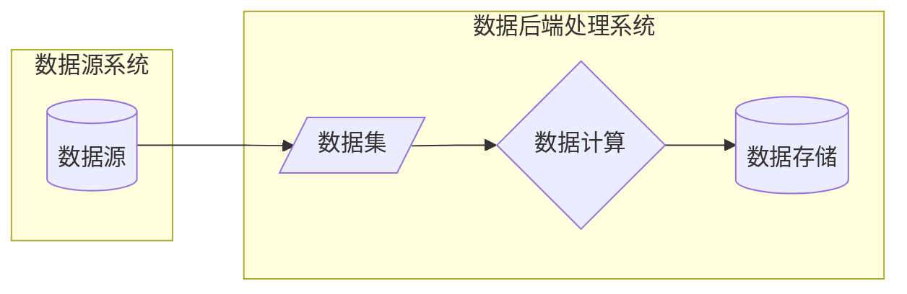
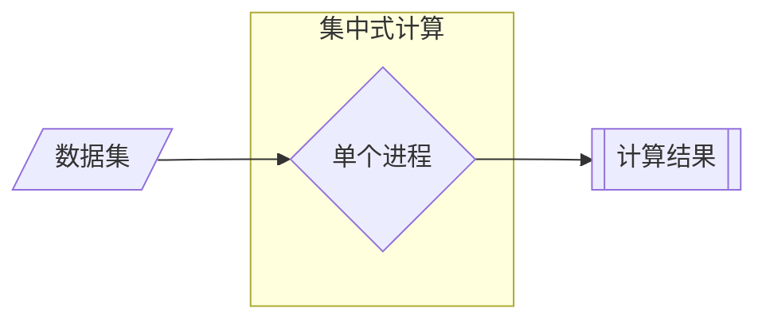
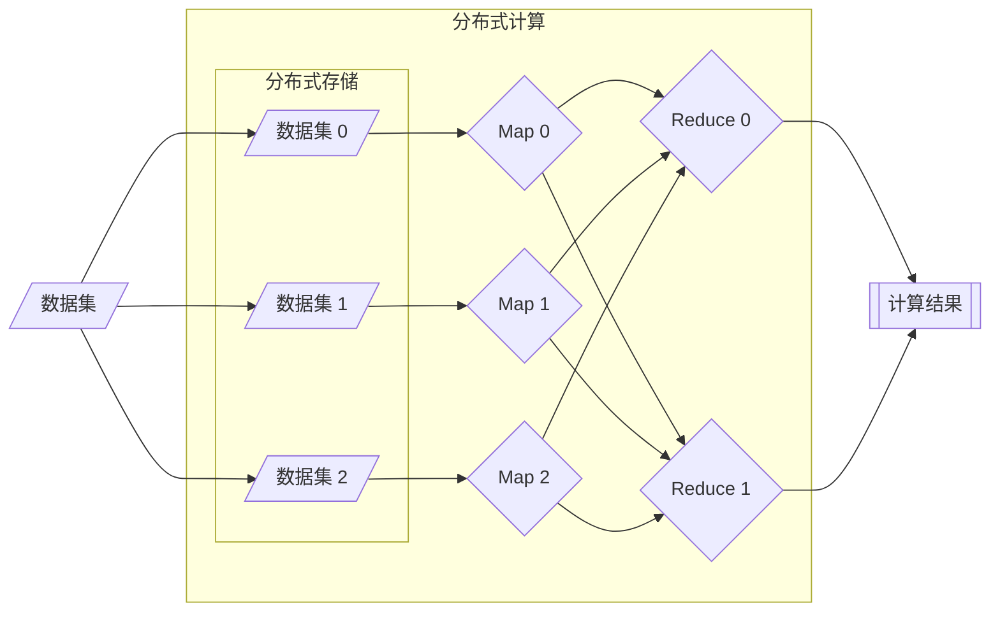
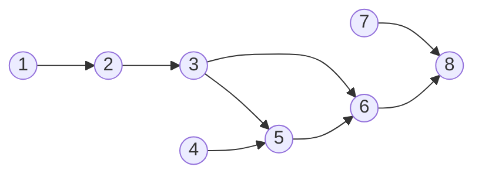

# Spark 分布式计算引擎

Apache Spark 是一个开源的类似于 Hadoop MapReduce 的通用的并行计算框架  
Spark 基于 MapReduce 算法实现分布式计算，拥有 Hadoop MapReduce 所具有的优点  
Spark 中 Job 的中间输出和结果可以保存在内存中，从而不再需要频繁读写磁盘

用于大规模数据处理的统一分析引擎

## 分布式计算

数据计算：将特定数据集处理成业务需要的模式



数据计算的形式多种多样，按历史进程可以分为：

- 大数据时代之前的集中式数据计算
- 大数据时代的分布式数据计算





分布式计算流程：

- 数据读取 Input
  - 读取数据，按照一定的规则将数据划分成多份，一般称为数据分片或者数据分区  
  - 将每个分区的数据读取机器的内存中，不同分区的数据放在不同的机器

- 数据处理 Process
  - 根据划分规则，每个分区的数据对应一个 Task 计算任务来计算
  - 每个 Task 计算任务可以运行在不同的机器上，使用多台机器的资源并行执行
  - YARN 的不同节点上会运行 MapTask 进程和 ReduceTask 进程

- 数据输出 Output
  - 使用 Task 将前面每个 Task 任务计算的结果进行合并，输出保存

第一代计算框架  MapReduce

第二代计算框架  TEZ  
基于 MR 引入 DAG 思想，底层依旧为MR

第三代计算框架  Spark  Presto  Impala
基于 DAG 的内存式设计

第四代计算引擎 Flink  
流处理实时计算引擎

## Spark 功能及特点

- 统一化离线计算与实时计算开发方式，支持多语言开发
- 通用 SQL 分析
- 大规模数据科学计算
- 训练机器学习

- 核心为 RDD 弹性分布式数据集
- 分布式计算框架
- 可以基于内存进行计算
- 以线程方式执行任务
- 基于 DAG 有向无环图进行计算

### RDD Resilient Distributed Dataset

#### RDD 的创建

方式一：并行化驱动程序中现有的集合

方式二：引用外部存储系统中的数据集

方式三：从其他 RDD 转换而来（最主要的创建方式）

#### 五大核心特性

- 分区列表
  - RDD 的数据会被切分成多个分区，这些分区分散在不同的集群节点上。
  - 正是这种分区的特性，使得 Spark 能够进行并行计算。每个分区由一个 Task 任务来处理。

- 分区间并行转换
  - RDD 的每个分区都有一个计算函数，Spark 在需要计算（或重新计算）时，会应用这个函数来得到该分区的数据。
  
- 依赖于其他 RDD 的列表
  - RDD 是通过一系列转换操作从其他 RDD 或稳定存储中的数据创建而来的。它会记录自己的“血统”，即它是如何从父 RDD 衍生过来的。
  - 这个血统关系图 是 Spark 实现容错 的核心机制。当某个分区的数据丢失时，Spark 可以根据这个血统图重新计算该分区，而不需要从头复制整个数据集。

- 可选：对于键值型 RDD 的分区器
  - 如果 RDD 是由键值对组成的，并且需要基于键进行分区（比如 reduceByKey 操作），则可以有一个分区器。常见的分区器有哈希分区器和范围分区器。
  - 分区器决定了数据在集群中是如何分布的，好的分区能极大提升 shuffle 操作的效率。

- 可选：计算每个分区的首选位置
  - Spark 会尽量将计算任务分配到离数据存储位置最近的节点上（例如，HDFS 数据块的位置），这被称为数据本地性，可以减少网络传输，大幅提升性能。

#### 两种操作

- 转换
  - 特点：惰性计算。调用转换操作并不会立即执行计算，它只是定义了一个新的 RDD，并记录了它与父 RDD 的依赖关系。
  - 类比：就像制定一个食谱，你只是写下了步骤，并没有真正开始做饭。

- 行动
  - 特点：触发计算。只有调用行动操作时，Spark 才会根据 RDD 的血统图，启动一个真正的作业，执行所有累积的转换操作，并返回一个结果给驱动程序或写入外部存储。
  - 类比：现在你按照食谱开始动手做饭，并最终得到可以吃的菜肴。

#### 算子

##### 转换算子

- 执行转换操作
- 返回值一定是新RDD
- 例子：map(), filter(), flatMap(), groupByKey(), reduceByKey(), join() 等。

```Python
def map(self, f: T -> U) -> RDD[U]

RDD[U] = RDD[T].map(lambda )
```

- 触发算子
  - 执行行动操作
  - 返回值一定不是RDD
  - 例子：count(), collect(), first(), take(n), saveAsTextFile(), foreach() 等。

### DAG Directed acyclic graph

如果有一个非有向无环图，且A点出发向B经C可回到A，形成一个环。将从C到A的边方向改为从A到C，则变成有向无环图



#### 为什么大数据技术需要 DAG？

举个场景：比如计算 “某电商平台一天内的用户购买数据”，可能需要分步骤处理：

1. 读取原始数据（从多个数据库或文件中获取）。
2. 清洗数据（去掉重复记录、补全缺失值，比如用户地址为空的记录要处理）。
3. 分组统计（按用户、商品类别等维度统计购买次数、金额）。
4. 生成报表（把结果整理成 Excel 或可视化图表）。

这些步骤有强依赖关系：必须先读取数据才能清洗，清洗完才能统计，统计完才能生成报表。  
但有些步骤可能可以并行：比如读取多个数据源（如用户表和订单表）可以同时进行，清洗不同类型的数据（如用户数据和商品数据）也可以同时做。

DAG 的作用就是清晰描述这种依赖关系和并行可能，让大数据框架（Spark）能自动安排任务：

- 按顺序执行必须依赖的任务（比如清洗完才能统计）。
- 并行执行没有依赖的任务（比如同时读取用户表和订单表）。
- 避免任务循环或混乱（比如不会让生成报表的任务先于统计完成）。

**大数据中 DAG 的核心优势**：

1. 任务调度高效：知道哪些任务能并行，减少等待时间（比如 Spark 用 DAG 优化任务执行顺序，让计算更快）。
2. 错误恢复方便：如果某个任务失败（比如清洗数据时出错），只需要重新执行该任务及其后续依赖的任务，不用从头再来。
3. 流程可视化：通过 DAG 图能一眼看出整个数据处理的逻辑，方便排查问题或调整流程。

### Spark 为什么比 MapReduce 快

- Spark处理数据时，可以将中间处理结果数据存储到内存中，减少磁盘I/O
- Spark Job调度为 DAG（有向无环图）方式
- 每个任务 Task 执行以线程（Thread）方式，并不是像 MapReduce 以进程（Process）方式执行
  - 进程 Process 方式：Task独享资源，不方便共享数据，执行效率低
  - 线程 Thread 方式：数据共享，执行效率高，但是会出现进程间资源竞争

#### MapReduce的优缺点

缺点：

- 无法实时返回计算结果
  - 数据量大
  - 启动时需要通过 YARN 分配资源、启动任务
  - 任务结果必须写入磁盘，多个存在依赖关系的任务需要反复读写磁盘
- 无法进行流式计算
  - 设计时未考虑进行流处理的需求，专门针对离线批处理

优点：

- 相对 Spark 耗费资源较少，在资源不充足的情况下也能得到计算结果

## Spark 组成

Master

- 负责任务调度

Worker

- 负责任务执行

spark运行时，Spark Application由2部分组成：Driver Program 和 Executors

DriverProgram

- 相当于 MRAppMaster，整个 Spark Application应用管理者，负责应用中所有 Job 调度执行
- 一个 SparkApplication，仅有一个 DriverProgram
- 以 JVM Process 进程运行，其实就是程序 MAIN 函数，必须创建 SparkContext 上下文对象

Executor

- 相当于1个线程池，以 JVM Process进程运行，其中运行 Task 任务，每个 Task 任务都是线程方式运行
- 此外，Executor 中可以将缓存数据到内存中，比如 RDD 数据
- 1个 SparkApplication 可以有多个 Executor，每个 Executor 可以资源（CPU Core 核数和 Memory 内存）

## Spark 部署模式

Spark 框架编写的应用程序支持多种运行模式：

1. 本地模式（Local Mode）
2. 集群模式（Cluster Mode）
3. 云端（K8s）：部署在K8S云服务上

### 本地模式

- LocalMode：在当前操作系统启动1个 JVM 进程，指定最多同时运行 Task 任务数目，以线程方式运行 Task 任务。
  - 本地模式时，可以认为 DriverProgram 和 Executor 合为一体，就是一个 JVM Process进程。
  - 当 Spark 程序运行在本地模式时，使用`--master local[N]`设置最多同时运行几个 Task，N表示 Task 数目。

### 集群模式

- Hadoop YARN集群模式（生产环境使用）
  - 运行在 YARN 集群之上，由 YARN 负责资源管理，Spark 负责任务调度和计算
  - 计算资源按需伸缩，集群利用率高，共享底层存储，避免数据跨集群迁移
- Spark Standalone集群模式（开发测试及生产环境使用）
  - 类似 Hadoop YARN架构，典型的 Mater/Slaves 模式
  - 使用 Zookeeper 搭建高可用，避免 Master 单点故障

***

