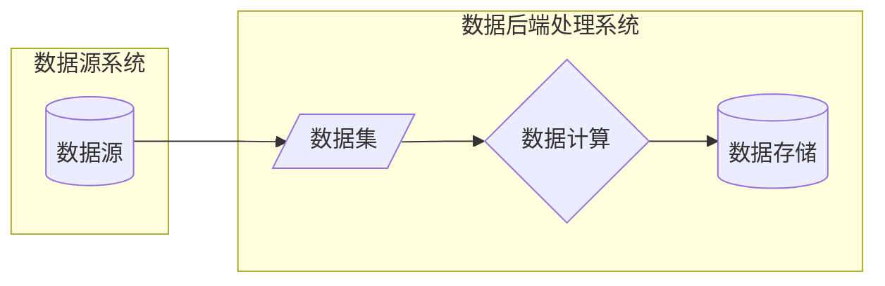
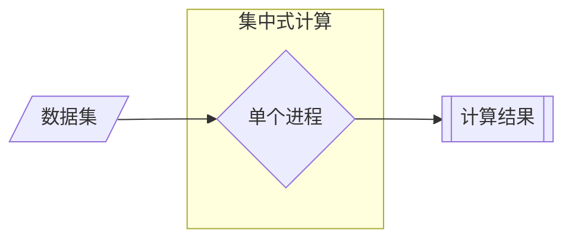

# Spark 分布式计算引擎

Apache Spark是一个开源的类似于Hadoop MapReduce的通用的并行计算框架  
Spark基于MapReduce算法实现分布式计算，拥有Hadoop MapReduce所具有的优点  
Spark中Job的中间输出和结果可以保存在内存中，从而不再需要频繁读写磁盘

用于大规模数据处理的统一分析引擎

## 分布式计算

数据计算：将特定数据集处理成业务需要的模式

数据计算的形式多种多样，按历史进程可以分为：

- 大数据时代之前的集中式数据计算
- 大数据时代的分布式数据计算

分布式计算流程：

- 数据读取 Input
  - 读取数据，按照一定的规则将数据划分成多份，一般称为数据分片或者数据分区  
  - 将每个分区的数据读取机器的内存中，不同分区的数据放在不同的机器

- 数据处理 Process
  - 根据划分规则，每个分区的数据对应一个Task计算任务来计算
  - 每个Task计算任务可以运行在不同的机器上，使用多台机器的资源并行执行
  - YARN的不同节点上会运行MapTask进程和ReduceTask进程

- 数据输出 Output
  - 使用Task将前面每个Task任务计算的结果进行合并，输出保存

第一代计算框架  MapReduce

第二代计算框架  TEZ  
基于MR引入DAG思想，底层依旧为MR

第三代计算框架  Spark  Presto  Impala
基于DAG的内存式设计

第四代计算引擎 Flink  
流处理实时计算引擎

## Spark 功能及特点

- 分布式计算框架
- 可以基于内存进行计算
- 以线程方式执行任务
- 基于DAG有向无环图进行计算

核心为RDD Resilient Distributed Dataset弹性分布式数据集

- 统一化离线计算与实时计算开发方式，支持多语言开发
- 通用SQL分析
- 大规模数据科学计算
- 训练机器学习

Spark 为什么比 MapReduce 快

- Spark处理数据时，可以将中间处理结果数据存储到内存中
- Spark Job调度以DAG（有向无环图）方式，并且每个任务Task执行以线程（Thread）方式，并不是像MapReduce以进程（Process）方式执行
  - 进程Process方式：Task独享资源，不方便共享数据，执行效率低
  - 线程Thread方式：数据共享，执行效率高，但是会出现进程间资源竞争

***

