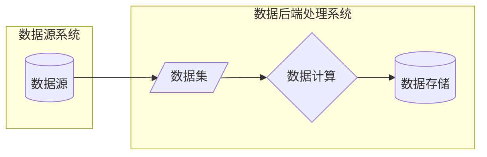
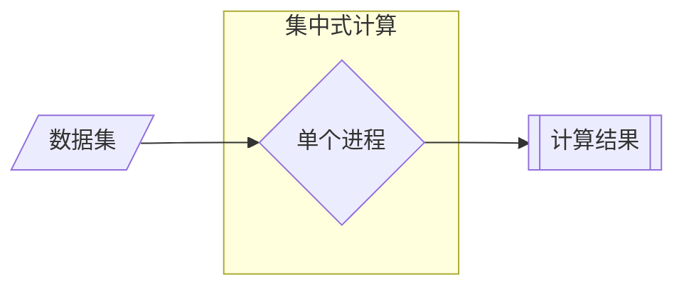
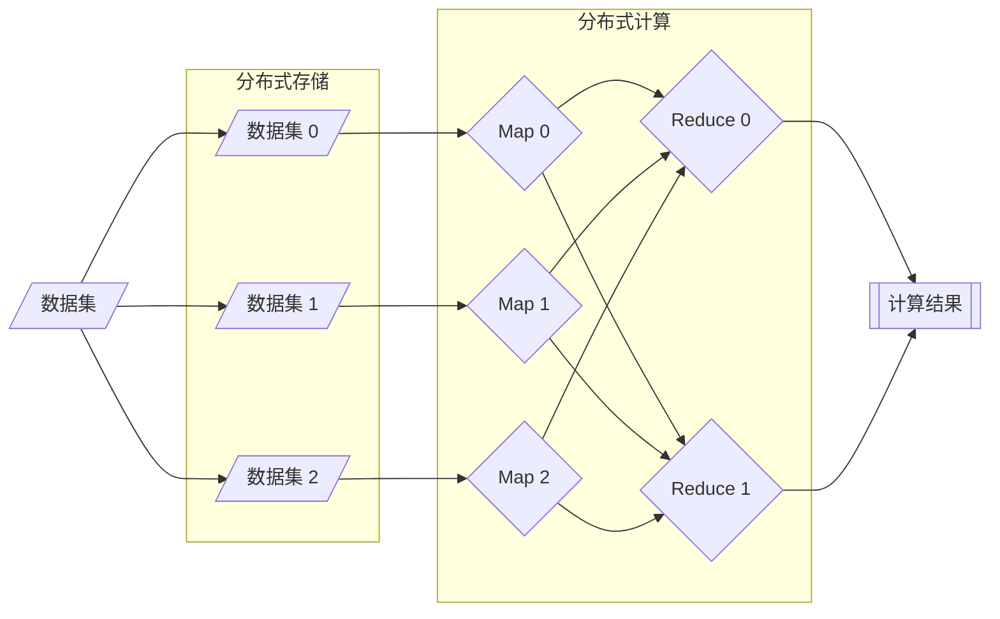
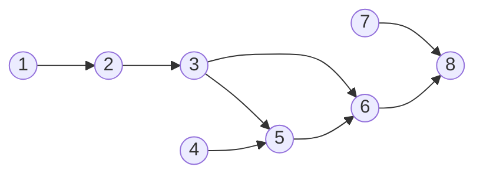

# Spark 分布式计算引擎

Apache Spark 是一个开源的类似于 Hadoop MapReduce 的通用的并行计算框架  
Spark 基于 MapReduce 算法实现分布式计算，拥有 Hadoop MapReduce 所具有的优点  
Spark 中 Job 的中间输出和结果可以保存在内存中，从而不再需要频繁读写磁盘

用于大规模数据处理的统一分析引擎

[官方 Github 仓库](https://github.com/apache/spark)

## 分布式计算

数据计算：将特定数据集处理成业务需要的模式



数据计算的形式多种多样，按历史进程可以分为：

- 大数据时代之前的集中式数据计算
- 大数据时代的分布式数据计算





分布式计算流程：

- 数据读取 Input
  - 读取数据，按照一定的规则将数据划分成多份，一般称为数据分片或者数据分区  
  - 将每个分区的数据读取机器的内存中，不同分区的数据放在不同的机器

- 数据处理 Process
  - 根据划分规则，每个分区的数据对应一个 Task 计算任务来计算
  - 每个 Task 计算任务可以运行在不同的机器上，使用多台机器的资源并行执行
  - YARN 的不同节点上会运行 MapTask 进程和 ReduceTask 进程

- 数据输出 Output
  - 使用 Task 将前面每个 Task 任务计算的结果进行合并，输出保存

第一代计算框架  MapReduce

第二代计算框架  TEZ  
基于 MR 引入 DAG 思想，底层依旧为MR

第三代计算框架  Spark  Presto  Impala
基于 DAG 的内存式设计

第四代计算引擎 Flink  
流处理实时计算引擎

## Spark 组成

Master

- 负责任务调度

Worker

- 负责任务执行

spark运行时，Spark Application由2部分组成：Driver Program 和 Executors

DriverProgram

- 相当于 MRAppMaster，整个 Spark Application应用管理者，负责应用中所有 Job 调度执行
- 一个 SparkApplication，仅有一个 DriverProgram
- 以 JVM Process 进程运行，其实就是程序 MAIN 函数，必须创建 SparkContext 上下文对象

Executor

- 相当于1个线程池，以 JVM Process进程运行，其中运行 Task 任务，每个 Task 任务都是线程方式运行
- 此外，Executor 中可以将缓存数据到内存中，比如 RDD 数据
- 1个 SparkApplication 可以有多个 Executor，每个 Executor 可以资源（CPU Core 核数和 Memory 内存）

### 核心组件 Core Components

Spark 官方维护的核心模块，通常包含在标准发行版中。

- Spark Core
  - 这是整个 Spark 项目的基础和核心，提供了最基础的功能。
  - 功能：任务调度、内存管理、故障恢复、与存储系统交互。
  - 核心概念：提供了对 RDD（弹性分布式数据集） 的 API 支持。RDD 是一个不可变的分布式对象集合，是 Spark 早期最重要的抽象。
  - 作用：所有其他上层模块（如 SQL、Streaming）都建立在 Spark Core 之上，并在此基础上扩展。

- Spark SQL
  - 这是用于处理结构化数据的模块，也是目前使用最广泛、最高效的 Spark 组件。
  - 功能：
    - 允许使用 SQL 或熟悉的 DataFrame/Dataset API 来查询数据。
    - 支持从多种数据源读取数据，如 Hive、Avro、Parquet、ORC、JSON、JDBC 等。
    - 可以使用标准的 JDBC/ODBC 连接器通过 BI 工具（如 Tableau）进行查询。
  - 核心抽象：DataFrame 和 Dataset，它们提供了比 RDD 更丰富的优化（Catalyst 优化器和 Tungsten 执行引擎）。
  - 重要性：Spark SQL 是大部分 Spark 应用的事实上的入口。

- Spark Streaming
  - 用于处理实时数据流的模块。
  - 功能：将连续的实时数据流切分成小批（micro-batches），然后将其作为一系列小批量作业进行处理，从而提供类似流处理的体验。
  - 核心抽象：DStream（离散化流），代表一个连续的数据流。
  - 注意：虽然仍被广泛使用，但官方推荐使用更新、更强大的 Structured Streaming。

- Structured Streaming
  - 构建在 Spark SQL 引擎之上的新一代流处理模块。
  - 功能：以处理静态结构化数据（DataFrame/Dataset）的方式来处理无限增长的实时数据流。开发者可以使用与批处理相同的 API 编写流处理应用。
  - 优势：受益于 Spark SQL 的 Catalyst 优化器和 Tungsten 执行引擎，性能更好，语义更完善（如端到端精确一次处理语义）。
  - 核心抽象：将流数据视为一张不断增长的无界表。

- MLlib (Machine Learning Library)
  - Spark 的可扩展机器学习库。
  - 功能：提供了常见的机器学习算法和工具，包括：
    - 特征提取和转换
    - 分类、回归、聚类、协同过滤
    - **pipelines（流水线）**：用于构建、评估和调整机器学习工作流。
  - 优势：能够直接在大规模分布式数据集上进行机器学习，并与 Spark 的其他组件无缝集成。

- GraphX (Graph Processing)
  - 用于图计算和图并行计算的 API。
  - 功能：提供了一套图操作符（如 subgraph、joinVertices）和多个图算法（如 PageRank、三角形计数）的实现。
  - 核心抽象：Graph，一个基于 RDD 的分布式图。
  - 现状：虽然功能强大，但其使用率低于 Spark SQL 和 MLlib。对于图处理，也有很多用户选择专门的图数据库或计算框架（如 Neo4j, JanusGraph）。

### 生态系统与集群管理器 Ecosystem & Cluster Managers

Spark 可以运行在多种集群管理模式上，并与其他大数据生态系统紧密集成。

- 集群管理器 (Cluster Managers) Spark 支持多种集群资源管理方式，使其非常灵活：
  - Standalone：Spark 自带的简单集群管理器，开箱即用。
  - Apache Hadoop YARN：Hadoop 生态的资源管理器，这是在生产环境中最常见的部署模式。
  - Apache Mesos：一个通用的集群管理器（现已逐渐被淘汰）。
  - Kubernetes (K8s)：容器编排领域的的事实标准，Spark 官方近年来大力支持的方向，是未来的趋势。

- 数据源连接器 (Data Sources) Spark 拥有一个庞大且不断增长的数据源生态系统，可以连接几乎所有常见的数据存储系统：
  - 文件系统：HDFS、S3、Azure Data Lake Storage、Google Cloud Storage 等。
  - 数据库：通过 JDBC 连接 PostgreSQL、MySQL 等；连接 Cassandra、MongoDB 等 NoSQL 数据库。
  - 数据仓库：Apache Hive、Snowflake、Redshift、BigQuery。
  - 消息队列：Kafka、Kinesis（常用于流处理数据源）。

- 社区项目与扩展 (Community Projects) 这些虽然不是 Spark 核心的一部分，但构成了强大的扩展生态系统：
  - Delta Lake：一个开源存储层，为 Spark 带来 ACID 事务、数据版本控制（时间旅行）等功能，大大提升了数据可靠性。
  - Koalas：让 Pandas 开发者能够在分布式 Spark 集群上运行代码的 API（现已集成到 PySpark 中作为 pandas API on Spark）。
  - Spark NLP：一个建立在 Spark MLlib 之上的自然语言处理库。

## Spark 功能及特点

- 统一化离线计算与实时计算开发方式，支持多语言开发
- 通用 SQL 分析
- 大规模数据科学计算
- 训练机器学习

- 核心为 RDD 弹性分布式数据集
- 分布式计算框架
- 可以基于内存进行计算
- 以线程方式执行任务
- 基于 DAG 有向无环图进行计算

### RDD Resilient Distributed Dataset

#### RDD 的创建

方式一：并行化驱动程序中现有的集合

使用`SparkContext`的`parallelize()`方法。

```python
data = [1, 2, 3, 4, 5]
list_rdd = sc.parallelize(data, numSlices=2)
```

方式二：引用外部存储系统中的数据集

主要使用`SparkContext`的`textFile()`方法。

```python
file_rdd = sc.textFile("<文件路径>", minPartitions=2)
```

方式三：从其他 RDD 转换而来（最主要的创建方式）

#### 五大核心特性

- **分区列表**
  - RDD 的数据会被切分成多个分区，这些分区分散在不同的集群节点上。
  - 正是这种分区的特性，使得 Spark 能够进行并行计算。每个分区由一个 Task 任务来处理。

- **分区间并行转换**
  - RDD 的每个分区都有一个计算函数，Spark 在需要计算（或重新计算）时，会应用这个函数来得到该分区的数据。
  
- **依赖于其他 RDD 的列表**
  - RDD 是通过一系列转换操作从其他 RDD 或稳定存储中的数据创建而来的。它会记录自己的“血统”，即它是如何从父 RDD 衍生过来的。
  - 这个血统关系图 是 Spark 实现容错的核心机制。当某个分区的数据丢失时，Spark 可以根据这个血统图重新计算该分区，而不需要从头复制整个数据集。

- **可选：对于键值型 RDD 的分区器**
  - 如果 RDD 是由键值对组成的，并且需要基于键进行分区（比如 reduceByKey 操作），则可以有一个分区器。常见的分区器有哈希分区器和范围分区器。
  - 分区器决定了数据在集群中是如何分布的，好的分区能极大提升 shuffle 操作的效率。

- **可选：计算每个分区的首选位置**
  - Spark 会尽量将计算任务分配到离数据存储位置最近的节点上（例如，HDFS 数据块的位置），这被称为数据本地性，可以减少网络传输，大幅提升性能。

#### 两种操作

- 转换
  - 特点：惰性计算。调用转换操作并不会立即执行计算，它只是定义了一个新的 RDD，并记录了它与父 RDD 的依赖关系。
  - 类比：就像制定一个食谱，你只是写下了步骤，并没有真正开始做饭。

- 行动
  - 特点：触发计算。只有调用行动操作时，Spark 才会根据 RDD 的血统图，启动一个真正的作业，执行所有累积的转换操作，并返回一个结果给驱动程序或写入外部存储。
  - 类比：现在你按照食谱开始动手做饭，并最终得到可以吃的菜肴。

### DAG Directed acyclic graph

如果有一个非有向无环图，且A点出发向B经C可回到A，形成一个环。将从C到A的边方向改为从A到C，则变成有向无环图



#### 为什么大数据技术需要 DAG？

举个场景：比如计算 “某电商平台一天内的用户购买数据”，可能需要分步骤处理：

1. 读取原始数据（从多个数据库或文件中获取）。
2. 清洗数据（去掉重复记录、补全缺失值，比如用户地址为空的记录要处理）。
3. 分组统计（按用户、商品类别等维度统计购买次数、金额）。
4. 生成报表（把结果整理成 Excel 或可视化图表）。

这些步骤有强依赖关系：必须先读取数据才能清洗，清洗完才能统计，统计完才能生成报表。  
但有些步骤可能可以并行：比如读取多个数据源（如用户表和订单表）可以同时进行，清洗不同类型的数据（如用户数据和商品数据）也可以同时做。

DAG 的作用就是清晰描述这种依赖关系和并行可能，让大数据框架（Spark）能自动安排任务：

- 按顺序执行必须依赖的任务（比如清洗完才能统计）。
- 并行执行没有依赖的任务（比如同时读取用户表和订单表）。
- 避免任务循环或混乱（比如不会让生成报表的任务先于统计完成）。

**大数据中 DAG 的核心优势**：

1. 任务调度高效：知道哪些任务能并行，减少等待时间（比如 Spark 用 DAG 优化任务执行顺序，让计算更快）。
2. 错误恢复方便：如果某个任务失败（比如清洗数据时出错），只需要重新执行该任务及其后续依赖的任务，不用从头再来。
3. 流程可视化：通过 DAG 图能一眼看出整个数据处理的逻辑，方便排查问题或调整流程。

### Spark 为什么比 MapReduce 快

- Spark处理数据时，可以将中间处理结果数据存储到内存中，减少磁盘I/O
- Spark Job调度为 DAG（有向无环图）方式
- 每个任务 Task 执行以线程（Thread）方式，并不是像 MapReduce 以进程（Process）方式执行
  - 进程 Process 方式：Task独享资源，不方便共享数据，执行效率低
  - 线程 Thread 方式：数据共享，执行效率高，但是会出现进程间资源竞争

#### MapReduce的优缺点

缺点：

- 无法实时返回计算结果
  - 数据量大
  - 启动时需要通过 YARN 分配资源、启动任务
  - 任务结果必须写入磁盘，多个存在依赖关系的任务需要反复读写磁盘
- 无法进行流式计算
  - 设计时未考虑进行流处理的需求，专门针对离线批处理

优点：

- 相对 Spark 耗费资源较少，在资源不充足的情况下也能得到计算结果

## Spark 部署模式

Spark 框架编写的应用程序支持多种运行模式：

1. 本地模式（Local Mode）
2. 集群模式（Cluster Mode）
3. 云端（K8s）：部署在K8S云服务上

### 本地模式

- LocalMode：在当前操作系统启动1个 JVM 进程，指定最多同时运行 Task 任务数目，以线程方式运行 Task 任务。
  - 本地模式时，可以认为 DriverProgram 和 Executor 合为一体，就是一个 JVM Process进程。
  - 当 Spark 程序运行在本地模式时，使用`--master local[N]`设置最多同时运行几个 Task，N表示 Task 数目。

### 集群模式

- Hadoop YARN集群模式（生产环境使用）
  - 运行在 YARN 集群之上，由 YARN 负责资源管理，Spark 负责任务调度和计算
  - 计算资源按需伸缩，集群利用率高，共享底层存储，避免数据跨集群迁移
- Spark Standalone集群模式（开发测试及生产环境使用）
  - 类似 Hadoop YARN架构，典型的 Mater/Slaves 模式
  - 使用 Zookeeper 搭建高可用，避免 Master 单点故障

## Spark Core

详细参考官方手册
[Apache Spark API Reference Spark Core](https://spark.apache.org/docs/latest/api/python/reference/pyspark.html)

熟悉RDD后，强烈建议学习DataFrame API。  
它构建在RDD之上，但通过Catalyst优化器和Tungsten执行引擎，提供了更好的性能和易用性（特别是类似SQL的声明式编程）。  
DataFrame是现在Spark开发的主流。

### pyspark.SparkContext

核心原则：**一个JVM进程中只能有一个活跃的SparkContext**

SparkDriver程序与集群的关系是通过SparkContext（sc）建立的。  
`sc`是你的应用程序与集群之间的连接桥梁。  
一个`sc`对应一个Spark应用（Application）。

```python
class pyspark.SparkContext(
    master=None, appName=None, sparkHome=None, 
    pyFiles=None, environment=None, batchSize=0, 
    serializer=CloudPickleSerializer(), 
    conf=None, gateway=None, jsc=None, 
    profiler_cls=<class 'pyspark.profiler.BasicProfiler'>, 
    udf_profiler_cls=<class 'pyspark.profiler.UDFBasicProfiler'>, 
    memory_profiler_cls=<class 'pyspark.profiler.MemoryProfiler'>)

"""  
Parameters
masterstr, optional
    Cluster URL to connect to (e.g. spark://host:port, local[4]).

appNamestr, optional
    A name for your job, to display on the cluster web UI.

sparkHomestr, optional
    Location where Spark is installed on cluster nodes.

pyFileslist, optional
Collection of .zip or .py files to send to the cluster and add to PYTHONPATH. These can be paths on the local file system or HDFS, HTTP, HTTPS, or FTP URLs.

environmentdict, optional
    A dictionary of environment variables to set on worker nodes.

batchSizeint, optional, default 0
    The number of Python objects represented as a single Java object. Set 1 to disable batching, 0 to automatically choose the batch size based on object sizes, or -1 to use an unlimited batch size

serializerSerializer, optional, default CPickleSerializer
    The serializer for RDDs.

confSparkConf, optional
    An object setting Spark properties.

gatewayclass:py4j.java_gateway.JavaGateway, optional
    Use an existing gateway and JVM, otherwise a new JVM will be instantiated. This is only used internally.

jscclass:py4j.java_gateway.JavaObject, optional
    The JavaSparkContext instance. This is only used internally.

profiler_clstype, optional, default BasicProfiler
    A class of custom Profiler used to do profiling

udf_profiler_clstype, optional, default UDFBasicProfiler
    A class of custom Profiler used to do udf profiling
"""
```


#### `sc = SparkContext()`

`sc = SparkContext(...)` 会向集群管理器（如YARN、Standalone）申请资源，启动Executor进程。

#### `sc.stop()`

`sc.stop()` 会断开连接，并通知集群管理器回收为该应用分配的所有资源（杀掉Executors）。

何时必须调用`sc.stop()`：

1. 如果你的代码是一个需要独立运行并最终退出的Python脚本（例如通过`spark-submit`提交或直接`python app.py`运行），你必须显式调用`sc.stop()`。
    - 脚本运行完毕后，Python进程会退出。如果你不主动关闭`sc`，它可能无法正确地通知集群管理器清理资源。
    - 这会导致集群中的Executor进程成为“僵尸”进程，继续占用着内存和CPU核心，直到超时后被集群管理器强制杀掉。
2. 当你想在同一个程序中创建新的SparkContext时
    - 如果你需要重启或重新配置SparkContext，你必须先停止当前的，再创建新的。

何时不需要（或不应该）调用`sc.stop()`：

1. 在交互式环境中（如Jupyter Notebook, PySpark Shell）
    - 原因：交互式环境通常为你自动创建好了sc（和sparkSession）。这个sc的生命周期与你的交互式会话绑定。你希望在整个探索数据的过程中保持连接活跃，避免反复启动和关闭Executor带来的巨大开销。
    - 注意事项：如果你想重启SparkContext（例如修改了无法动态生效的配置），你可以在Notebook中手动调用sc.stop()，然后重新运行创建sc的单元格。但通常情况下没必要。
2. 当你的Spark应用因为错误而崩溃时（Cannot Do）
    - 如果你的Driver程序因为未处理的异常而崩溃，进程会直接终止。
    - 在这种情况下，集群管理器（如YARN）会检测到Driver进程丢失，并自动触发清理过程，杀掉对应的Executor。

养成在独立脚本中使用`with SparkContext() as sc:`语法块的习惯。  
这是最安全、最清晰、最Pythonic的方式，它能保证在任何情况下（即使程序中途出错）资源都会被正确释放。

### 转换算子

- 执行转换操作
- 返回值一定是新RDD
- 例子：map(), filter(), flatMap(), groupByKey(), reduceByKey(), join() 等。

#### `map(func)`

最核心的算子。对RDD中的每个元素应用函数`func`，返回一个新的RDD。

```python
# MapReduce: 对每一行文本进行处理
rdd = sc.parallelize(["hello world", "hi spark"])
# 将每一行字符串拆分成单词
words_rdd = rdd.map(lambda line: line.split(" "))
# 结果: [['hello', 'world'], ['hi', 'spark']]
```

#### `flatMap(func)`

与`map`类似，但`func`的返回值必须是一个可迭代对象（如列表），然后它会将这个可迭代对象“压平”后再放入新的RDD。

```python
# 经典WordCount的第一步
rdd = sc.parallelize(["hello world", "hi spark"])
words_rdd = rdd.flatMap(lambda line: line.split(" "))
# 结果: ['hello', 'world', 'hi', 'spark'] 
# (注意：这是一个一维列表，而不是嵌套列表)
```

#### `mapValues(func)`

将键值对RDD中的每个值通过一个映射函数处理，但不改变键；这样也能保持原始RDD的分区情况。

#### `filter(func)`

过滤。只保留使得`func`返回值为`True`的元素。

```python
numbers_rdd = sc.parallelize([1, 2, 3, 4, 5])
filtered_rdd = numbers_rdd.filter(lambda x: x % 2 == 0) # 取偶数
# 结果: [2, 4]
```

#### `mapPartitions(func)`

`func`的参数是整个分区的迭代器，返回值也是一个迭代器。  
它让您可以在每个分区上执行一次初始化操作（如创建数据库连接），而不是为每个元素执行一次。

```python
def process_partition(partition_iter):
    # 在每个分区开始时建立昂贵的连接
    expensive_connection = create_expensive_connection()
    for record in partition_iter:
        # 对分区内的每个记录进行处理，使用同一个连接
        processed_record = ... # 使用 connection
        yield processed_record
    # 分区处理完后，可以关闭连接
    expensive_connection.close()

rdd.mapPartitions(process_partition)
```

#### `groupByKey()`

将具有相同键的值分组到一个序列中。

```python
pairs_rdd = sc.parallelize([("a", 1), ("b", 2), ("a", 3)])
grouped_rdd = pairs_rdd.groupByKey()
# 结果: [("a", [1, 3]), ("b", [2])]
```

**警告**：在Spark中，直接使用groupByKey通常性能较差，因为它会在网络上传输所有数据。  
优先使用reduceByKey或aggregateByKey，因为它们会在Shuffle前先在Map端进行Combine（本地聚合）。

#### `reduceByKey(func)`

最常用且高效。

首先在每个分区内对相同键的值使用func进行聚合，然后将每个分区的结果进行跨分区聚合。这大大减少了Shuffle的数据量。

```python
# 经典WordCount的第二步
word_pairs_rdd = words_rdd.map(lambda word: (word, 1))
word_counts_rdd = word_pairs_rdd.reduceByKey(lambda a, b: a + b)
# 结果: [('hello', 1), ('world', 1), ('hi', 1), ('spark', 1)]
# 如果数据更多，它会在本地先做(hello, 1+1)的合并，再全局合并。
```

#### `aggregateByKey(zeroValue, seqFunc, combFunc)`

比reduceByKey更通用。

它允许聚合后的返回值类型与输入值类型不同。

- zeroValue: 初始值。
- seqFunc: 用于在分区内合并值的函数。
- combFunc: 用于合并不同分区的聚合结果的函数。

```python
# 求每个键的平均值 (总和，计数)
pairs_rdd = sc.parallelize([("a", 10), ("a", 20), ("b", 5), ("b", 15)])
# zeroValue: (sum, count)
zero_val = (0, 0)
# seqFunc: 在每个分区内，将值累加到(sum, count)中
seq_func = lambda local_agg, value: (local_agg[0] + value, local_agg[1] + 1)
# combFunc: 合并不同分区的(sum, count)
comb_func = lambda agg1, agg2: (agg1[0] + agg2[0], agg1[1] + agg2[1])
result_rdd = pairs_rdd.aggregateByKey(zero_val, seq_func, comb_func)
# 计算平均值
avg_rdd = result_rdd.mapValues(lambda x: x[0] / x[1])
# 结果: [('a', 15.0), ('b', 10.0)]
```

#### `sortByKey(ascending=True)`

根据键对RDD进行排序。

#### `join(otherRdd)`

对两个(K, V)和(K, W)类型的RDD进行内连接，返回(K, (V, W))。

```python
rdd1 = sc.parallelize([(1, "A"), (2, "B")])
rdd2 = sc.parallelize([(1, "X"), (2, "Y")])
joined_rdd = rdd1.join(rdd2)
# 结果: [(1, ('A', 'X')), (2, ('B', 'Y'))]
```

### 触发算子

- 执行行动操作
- 返回值一定不是RDD
- 例子：count(), collect(), first(), take(n), saveAsTextFile(), foreach() 等。

#### `collect()`

将整个RDD的所有数据拉取到Driver程序中，以一个数组的形式返回。

**仅在结果数据很小（例如<100MB）时使用**，否则会导致Driver内存溢出（OOM）。

#### `count()`

返回RDD中元素的个数。

#### `countByKey()`

计算每个键出现的次数，返回一个Python字典。

#### `take(n)`

返回RDD中的前n个元素。

#### `first()`

返回RDD中的第一个元素，等价于take(1)。

#### `reduce(func)`

使用函数func（接受两个参数，返回一个值）来聚合RDD中的所有元素。

```python
numbers_rdd = sc.parallelize([1, 2, 3, 4])
total = numbers_rdd.reduce(lambda a, b: a + b) # 结果: 10
```

#### `foreach(func)`

对RDD中的每个元素应用函数func。通常用于将数据写入外部数据库或推送消息。

```python
def send_to_db(record):
    # 假设有一个数据库连接
    db_connection.write(record)
result_rdd.foreach(send_to_db)
```

#### `saveAsTextFile(path)`

将RDD保存到文本文件（可以是HDFS、本地文件系统等）。每个分区会保存为一个文件（如part-00000）。

## Spark SQL


## RDD 与 DataFrame 的对比

### RDD 的优势与劣势

**RDD (Resilient Distributed Dataset)**：Spark最基础的数据抽象，代表一个**不可变、可分区、可并行计算**的分布式元素集合。它本质上是**面向对象**的，你对数据进行操作时，处理的是一个个JVM对象（在Python中是Python对象）。

#### 优势 (Why you might choose RDD)

1. 底层控制与灵活性 (Low-Level Control & Flexibility)
    - RDD是Spark最底层的抽象，你可以用它实现任何你能想到的计算逻辑，无论多么复杂、非结构化。
    - 用例：处理高度非结构化的数据（如文本流、图像流），或者需要实现非常定制化、复杂的迭代算法（例如某些图算法或机器学习算法）。

2. 编译时类型安全 (Compile-Time Type Safety)
    - 在Java和Scala中，RDD是强类型的（如RDD[Person], RDD[(String, Int)]）。这意味着类型错误会在编译时就被发现，而不是在运行时才报错，提高了代码的健壮性。
    - 用例：对代码稳定性和类型安全要求极高的复杂应用。

3. 面向对象编程风格 (Object-Oriented Programming)
    - 你可以使用熟悉的面向对象范式，通过map、flatMap、filter等高阶函数，用匿名函数或命名函数来处理每个对象。
    - 对于来自函数式编程背景的开发者来说，这种方式非常直观。

#### 劣势 (Why you might avoid RDD)

1. 性能开销大 (Performance Overhead)
    - 无优化引擎：Spark Core（执行RDD）对RDD的计算过程是“黑盒”的，它不知道你要做什么，只能按代码一步步执行，无法进行深度优化。
    - 对象序列化/GC开销：每个步骤中的数据都是以JVM/Python对象的形式存在，大量的对象创建和销毁会导致高昂的序列化/反序列化成本和垃圾回收（Garbage Collection） 压力，尤其是在数据量巨大时。
    - 内存使用：基于对象的存储效率较低。

2. 开发效率较低 (Lower Developer Productivity)
    - 你需要手动编写和优化每一步计算。例如，即使是一个简单的“按部门分组并求平均工资”，你也需要手动用map、reduceByKey等操作来实现，代码冗长且容易出错。

3. API相对底层 (Lower-Level API)
    - 对于常见的SQL类操作（如过滤、分组、聚合、连接），使用RDD API比使用SQL或DataFrame API更繁琐。

### DataFrame 的优势与劣势

**DataFrame**：以RDD为基础，但带有**模式（Schema）** 的分布式数据集合。你可以把它看作是一个分布式数据库表。它是**面向列**的，并且其背后是Spark SQL引擎。在Scala和Java中，DataFrame实际上是`Dataset[Row]`的别名。

#### 优势 (Why you might choose DataFrame)

1. 极高的性能 (High Performance)
    - Catalyst优化器：这是DataFrame最大的优势。Spark SQL的Catalyst优化器会对你编写的代码（无论是SQL还是DataFrame API）进行逻辑优化和物理优化（如谓词下推、列剪枝、常量折叠、成本优化选择join策略等），生成一个高度优化的执行计划。
    - Tungsten执行引擎：它直接在二进制格式上操作，完全跳过JVM对象。
    - 列式存储：数据按列存储，对于只访问某几列的查询极其高效。
    - 堆外内存管理：减少GC开销。
    - 代码生成：在运行时生成优化的字节码。

2. 开发效率高 (High Developer Productivity)
    - 声明式API：你只需要声明你想要什么（groupBy("dept").avg("salary")），而不需要指定如何计算。这大大简化了代码。
    - 无缝集成SQL：你可以直接对DataFrame运行SQL查询，这对于熟悉SQL的数据分析师和工程师来说门槛极低。
    - 丰富的内置函数：提供了大量针对结构化数据操作的高效内置函数（在org.apache.spark.sql.functions包中），避免了大量自定义函数的编写。

3. 生态集成好 (Ecosystem Integration)
    - DataFrame是与Spark其他高阶组件（如Streaming、MLlib）交互的标准接口。读取和写入各种数据源（Parquet, ORC, JSON, JDBC, Avro等）的API都是基于DataFrame构建的。

#### 劣势 (Why you might avoid DataFrame)

1. 编译时类型安全较弱 (Weaker Compile-Time Type Safety)
    - 由于DataFrame中的每一行都是一个通用的Row对象，其字段的类型是在运行时通过Schema来检查和解析的。这意味着如果你错误地引用了一个不存在的列名，错误要到运行时才会抛出。
    - 注意：在Scala中，你可以使用强类型的Dataset[T]（需要显式编码器）来在性能和类型安全之间取得平衡，但它通常比DataFrame稍慢。

2. 灵活性受限 (Limited Flexibility)
    - DataFrame要求数据必须是结构化的或半结构化的（即有Schema）。如果你需要处理完全非结构化的数据，或者执行一些无法用SQL范式表达的极端复杂的操作，RDD可能是更好的选择。

### 对比总结表

| 特性 | RDD | DataFrame |
| - | - | - |
| 数据表示 | JVM/Python对象集合 | 带Schema的分布式表（Row对象集合） |
| 编程范式 | 面向对象 / 函数式 | 声明式（SQL风格） |
| 类型安全 | 编译时类型安全（Scala/Java） | 运行时类型检查 |
| 优化级别 | 无，开发者手动优化 | Catalyst优化器自动进行深度优化 |
| 执行引擎 | 基于JVM对象的常规Spark引擎 | Tungsten（列式、堆外、代码生成） |
| 性能 | 较低（GC、序列化开销大） | 极高（跳过JVM对象，多种优化） |
| 开发效率 | 较低（需手动编写逻辑） | 高（声明式API，内置大量函数） |
| 灵活性 | 极高，可处理任何数据类型和逻辑 | 受限，需遵循结构化数据模型 |
| 主要用例 | 非结构化数据处理、定制化算法、需要编译时类型安全的复杂应用 | 绝大多数结构化数据批处理和SQL分析、ETL任务、机器学习流水线 |

### 结论与建议

- 对于绝大多数应用场景（95%以上），尤其是在进行数据清洗、聚合、分析和机器学习时，**应该优先使用DataFrame（或Dataset）**。其性能优势和开发效率优势是压倒性的。

- 在极少数情况下考虑使用RDD：
  - 处理完全非结构化的原始数据源。
  - 需要实现一个无法用DataFrame API或SQL表达的、极其复杂和定制化的计算逻辑。
  - 在Scala/Java应用中，对编译时类型安全有极致要求，且愿意为此牺牲性能。

从Spark的发展趋势来看，DataFrame/Dataset API是未来的核心，所有的新特性和优化都会优先集中在这里。  
RDD作为底层基础仍然重要，但大多数用户应该在其之上更高级的抽象进行开发。

***

