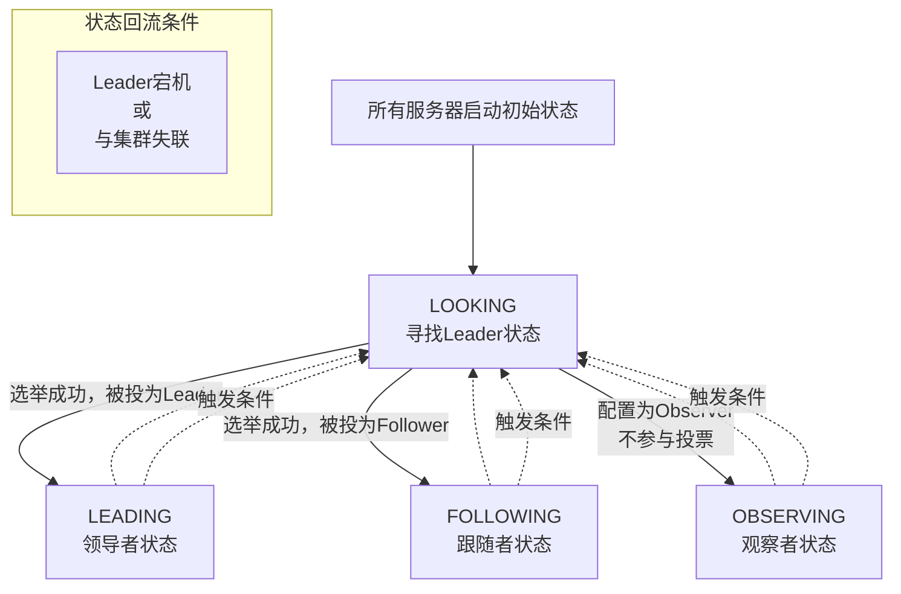

# ZooKeeper 分布式协调服务框架

用于解决分布式集群中应用系统的一致性问题和数据管理问题

- 分布式：多台服务器之间通过网络通信，对外提供不同服务
- 集群：多台服务器之间通过网络通信，对外提供同一服务

## ZooKeeper的功能

- 一致性服务
- 注册中心
- 命名服务
- 分布式锁
- 选举
- 数据发布订阅

## ZooKeeper的架构

主从架构的高可用集群

- Leader
  - 一个ZooKeeper集群同一时间只会有一个Leader，发起并维护与各Follower及Observer间的心跳  
  - 负责处理所有客户端的写请求（如创建节点、设置数据等）
  - 将写操作转换为事务提案（Proposal） 并广播给所有 Follower
  - 负责协调和推进数据同步（数据广播）
- Learner
  - Follower
    - 响应Leader的心跳
    - 处理客户端的读请求，并将其直接返回本地数据
    - 将写请求转发给 Leader
    - 参与 Leader 的选举投票
    - 参与事务提案的投票，接收到 Leader 的提案后，会对其进行投票，并在收到足够多的确认后提交该提案（将数据持久化到本地）
  - Observer
    - 与 Follower 唯一的不同是不参与任何形式的投票（包括选举投票和事务提案投票）
    - 只处理读请求和同步数据，其目的是为了横向扩展系统的读性能，而不影响写操作的吞吐量

### 节点状态

`Looking`

- 含义：该服务器正在主动寻找 Leader，或者认为没有 Leader，正在发起新一轮的领导者选举。
- 触发时机：
  - 服务器刚启动时：所有服务器启动初始阶段都会先进入 LOOKING 状态，尝试加入集群或发起选举。
  - Leader 崩溃或失联时：当 Follower 与 Leader 的心跳检测失败（会话超时），它会认为当前的 Leader 已经宕机，随后将自己的状态改为 LOOKING，开始新一轮选举。
- 行为：处于此状态的服务器会与其他服务器进行通信，交换投票信息，根据 (epoch, zxid, sid) 的规则来选举新的 Leader

`Leading`

- 含义：该服务器作为 Leader 角色正常运行。它是集群的核心和主节点。
- 触发时机：当一台服务器在选举投票中，发现自己得到了超过半数（Quorum）的投票，即被选举为 Leader。
- 行为：
  - 处理客户端写请求：所有客户端的写操作都由它唯一处理。
  - 管理数据同步流程：
  - 提出提案（Propose）：将写操作转换为一个事务提案（Proposal），并广播给所有的 Follower。
  - 收集投票（Ack）：等待 Follower 的确认（ACK）。一旦收到超过半数的 Follower 的 ACK，就认为该提案已提交。
  - 提交提交（Commit）：向所有的 Follower 发送一个 COMMIT 消息，通知它们将该提案持久化到本地。同时自己也执行提交。
  - 与 Follower 保持心跳：接收 Follower 的 PING 消息，维护与它们的连接

`Following`

- 含义：该服务器作为 Follower 角色正常运行。它是集群中的工作节点和备份。
- 触发时机：当一台服务器在选举投票中，确认了某个 Leader（不一定是自己，而是投票结果），并且自己不是被选举出的 Leader 时，就会进入 FOLLOWING 状态。
- 行为：
  - 处理客户端读请求：直接返回本地数据，这是为什么 ZooKeeper 读性能可以横向扩展的原因。
  - 转发写请求：将客户端的所有写请求转发给 Leader 处理。
  - 参与数据同步（写操作）：接收来自 Leader 的事务提案（Proposal），对其进行投票，并在收到提交命令后将数据持久化到本地。
  - 与 Leader 保持心跳：定期向 Leader 发送 PING 消息，以表明自己存活

`Observing`

- 含义：该服务器作为 Observer 角色正常运行。它是一种特殊的 Follower。
- 触发时机：在配置文件中被明确标识为 observer 的服务器，在选举过程中不会参与投票。当选举完成后，它会同步 Leader 的数据，并进入 OBSERVING 状态。
- 行为：
  - 处理客户端读请求：与 Follower 完全一样，直接返回本地数据，用于扩展读性能。
  - 同步Leader数据：接收 Leader 的提案和提交消息，保持数据与 Leader 最终一致。
  - 不参与任何投票：既不参与领导选举投票，也不参与写操作提案的投票。这是它与 Follower 的唯一但至关重要的区别。
- 设计目的：允许在不影响写操作性能的前提下，无限地横向扩展读性能。因为增加 Observer 节点不会增加投票阶段的网络开销和延迟

### ZooKeeper 选举机制

ZooKeeper 的选举机制是一个通过投票和比较 (Epoch, ZXID, SID) 来达成多数派共识的过程。  
它的设计目标是快速选出一个数据最新的节点作为Leader，确保系统在故障后能快速恢复并保持数据一致性。  
这套机制是ZooKeeper作为分布式协调服务稳定可靠的基础

#### 选举的触发

- 服务器启动时
  - 当整个集群启动时，所有服务器都是平等的，它们需要通过选举过程来决出唯一的 Leader。
- Leader 失能时
  - 当原有的 Leader 服务器因为网络分区、宕机等原因无法与集群中大多数节点通信时，剩余的服务器会检测到这一情况，将自身状态修改为`Looking`并立即发起新一轮的选举，以推举出新的 Leader，保证集群继续可用

#### 选举的核心规则

基于(Epoch, ZXID, SID)三元组进行比较，优先级依次降低

- 逻辑时钟 (Epoch)
  - 选举轮次的标识，每次选举开始时递增，避免旧轮次选票干扰结果
- 最新事务ID (ZXID) ZooKeeper Transaction ID
  - 64位的节点最新处理的事务ID，越大表示该节点数据越新
- 服务器ID (SID)
  - 节点的唯一标识，即myid，在配置文件中设置

#### 选举流程

1. 服务器间交换投票信息
    - 优先投票给自己
    - 将本服务器投票信息以(Epoch, SID, ZXID)的格式发送给集群内其他服务器
2. 处理投票
    - 每台服务器都会接收来自其他服务器的投票
    - 当接收到一张外部选票时，它会根据核心规则与自己的当前投票进行比较
        - 如果外部选票的 Epoch 更大，则更新自己的 Epoch 并认可这张外部选票
        - 如果 Epoch 相同，则比较 ZXID。如果外部选票的 ZXID 更大，说明对方数据更新，则认可这张外部选票（即改为推荐对方）
        - 如果 Epoch 和 ZXID 都相同，则比较 SID。如果外部选票的 SID 更大，则认可这张外部选票
3. 更新和广播新投票
    - 一旦服务器决定认可另一张选票（即改变了推荐对象），它会更新自己的投票，然后将这张新的投票再次广播给所有其他服务器
4. 确认Leader (选举终止)
    - 这个过程不断重复，服务器们不断地接收、比较、更新和广播投票。
    - 当某一台服务器收到的投票中，有超过半数（Quorum）的服务器都认可了同一个候选者时，选举结束
5. 状态切换与同步
    - 被选举为 Leader 的服务器将自己的状态从 LOOKING 切换为 LEADING
    - 其他服务器将自己的状态从 LOOKING 切换为 FOLLOWING 或 OBSERVING
    - 重要：新的 Leader 会等待所有 Follower 连接上来，并确保所有 Follower 都同步了它的最新数据（ZXID）之后，才会开始对外提供服务（处理写请求）。这一步保证了数据的一致性，不会因为新Leader数据较新而导致Follower数据回滚

#### 关键特性和注意事项

##### 多数派原则 (Quorum)

- 必须有超过半数的服务器达成一致，选举才能成功。这也是为什么集群服务器数量推荐为奇数的原因。
  - 3台服务器允许1台故障。
  - 4台服务器也只能允许1台故障（半数以上是3，剩下3台才能选举）。容错能力与3台一样，但成本更高，因此奇数台更划算。

##### 数据一致性优先

- 选举机制优先选择数据最全（ZXID最大）的服务器作为Leader，最大限度地保证了数据不会丢失。

##### 防止脑裂

- Quorum（多数派）
  - 在一个发生网络分区的环境中，至多只有一个分区能拥有超过半数的服务器并成功选举出Leader，另一个分区因节点数不足半数而无法选举。
  - 从物理上保证最多只有一个分区能行使领导权，其他分区无法选举，无法形成脑裂

- Epoch（纪元）
  - 为每次选举分配一个递增的编号，集群只认可最新Epoch的Leader
  - 从逻辑上保证过期的领导者会被立刻识别并失效，无法造成混乱

## 事务提案投票机制

1. 客户端发起请求，Leader接收
    - 客户端向 ZooKeeper 集群发起一个写请求（例如，create /app/task1 data）。
    - 如果请求发送到了 Follower，Follower 会将其转发给 Leader。
    - Leader 接收到这个写请求。
2. Leader 创建提案
    - Leader 为这个写操作生成一个事务提案。这个提案包含了操作的所有信息（路径、数据、权限等）。
    - Leader 为这个提案分配一个全局唯一的 ZXID。这个 ZXID 比之前任何一个已发出的 ZXID 都要大，保证了事务的顺序性。
3. 广播提案
    - Leader 使用 FIFO（先进先出） 的通道，将这个提案消息广播给集群中所有的 Follower。
    - Observer 也会收到这个提案，但它们不参与后续的投票，只进行学习以保持数据同步。
4. Follower 处理提案并“投票”
    - 每个 Follower 接收到 Leader 发来的提案后，会进行如下操作：
        1. 验证提案：检查其格式、权限等是否有效。
        2. 持久化到事务日志：将提案事务完整地、顺序地追加（append）到本地的磁盘事务日志中。这是一个写磁盘操作，是保证数据不丢失的关键。
        3. 返回 ACK：一旦事务日志成功写入磁盘，Follower 就会向 Leader 发送一个 ACK 消息（确认消息），ACK 中包含了该提案的 ZXID。
    - 关键点：这里的“投票”并非选择性地赞成或反对，而更像是一个确认（Acknowledgement）。只要提案有效且被成功持久化，Follower 就会发送 ACK。这保证了只要提案被提交，它一定已在多数派服务器上持久化。
5. Leader 收集 ACK 并提交
    - Leader 等待并收集来自 Follower 的 ACK。
    - Leader 遵循 “超过半数”（Quorum） 原则。一旦它收到超过半数的 Follower 的 ACK（包括自己），它就认为这个提案已经被提交（committed）。
        - 例如，在一个 3 节点的集群（S1, S2, S3）中，Leader（S3）只需要收到一个 Follower（比如 S1）的 ACK，加上它自己，就达到了半数以上（2 > 3/2）。
6. Leader 提交并通知客户端
    - 提交（Commit）：Leader 正式将事务应用到本地的内存数据树（Data Tree） 中。此时，数据在 Leader 上才真正可见。
    - 响应客户端：Leader 向客户端返回一个成功的响应（例如，“Node created”）。
7. Leader 广播 COMMIT（可选但重要）
    - 虽然数据已经提交，Leader 还会向所有的 Follower 和 Observer 发送一个 COMMIT 消息。
    - 这里的 COMMIT 是一个轻量级的消息，通常只包含 ZXID，而不是完整的提案数据。
    - Follower 收到 COMMIT 消息后，才会将事务应用到自己的内存数据树中，使得数据对连接到该 Follower 的客户端可见。

> 为什么需要 COMMIT 消息？ 这是一个性能优化。Follower 在收到提案时就已经将其持久化到磁盘了，但可能不会立即应用到内存。Leader 的 COMMIT 消息是一个明确的指令：“现在可以安全地应用这个事务了”。这保证了所有服务器应用事务的顺序与 Leader 发出提案的顺序完全一致。

### 总结与关键特点

#### 两阶段提交（2PC）的变体：这个过程类似于两阶段提交

- 阶段一（广播提案）：Leader 广播 Proposal。
- 阶段二（提交）：在收到多数派的 ACK 后，广播 Commit。

但它不是标准的 2PC，因为它没有“回滚”机制。一旦提案被发出，它最终一定会被提交（只要Leader认为达到了多数派）。

#### 数据一致性保证

- 顺序一致性：通过单调递增的 ZXID 保证。
- 原子性：一个事务要么被所有服务器提交，要么都不提交。
- 持久性：在返回成功给客户端之前，提案已经在超过半数的服务器上持久化到磁盘。即使 Leader 立刻宕机，新选出的 Leader 也一定拥有这个已提交的提案，会继续将其同步给整个集群。

#### 性能与可靠的权衡

- 写操作需要等待磁盘 I/O（持久化日志）和网络往返（广播和收集ACK），因此延迟较高。
- 读操作可以直接从 Follower 的内存中读取，因此延迟很低。这种读写分离的设计是 ZooKeeper 高性能的关键。

## HDFS高可用性的实现

### 核心组件与机制

#### ZKFC（ZooKeeper Failover Controller）

这是一个独立进程，运行在每个 NameNode 节点上，充当 NameNode 的“经纪人”。  
主要负责监控 NameNode 的健康状态（通过 HealthMonitor），并在 ZooKeeper 中管理会话和参与选举（通过 ActiveStandbyElector）。

#### ZooKeeper 的作用

ZooKeeper 在此过程中扮演了协调者的角色。它主要提供：

- 临时节点（Ephemeral Node）
  - 用于实现主动选举。哪个 ZKFC 成功在特定路径（如 `/hadoop-ha/${dfs.nameservices}/ActiveStandbyElectorLock`）创建了临时节点，它代理的 NameNode 就成为 Active NameNode。
  - ZKFC 会与 ZooKeeper 维持一个会话（Session），如果 Active NameNode 故障或其 ZKFC 与 ZooKeeper 网络不通，会话超时后，ZooKeeper 会自动删除该临时节点，从而触发新一轮选举。

- 监听机制
  - Standby NameNode 的 ZKFC 会监听上述临时节点。如果节点被删除（表明 Active NameNode 可能出问题了），ZooKeeper 会通知所有监听的 ZKFC，它们就会开始尝试争抢创建该临时节点，从而选举出新的 Active NameNode。

#### 防止脑裂（Fencing）

这是确保在同一时刻只有一个 Active NameNode 的关键安全措施，防止“双主”导致的数据混乱。HDFS 采用了多种防护机制：

- ZooKeeper 层面的防护
  - 成功的 Active NameNode 除了创建临时节点 `ActiveStandbyElectorLock`，还会在 ZooKeeper 中创建一个持久节点 `ActiveBreadCrumb`，其中存储了它的地址信息。
  - 如果之前的 Active NameNode 异常退出（例如 ZKFC 进程崩溃），这个持久节点会保留下来。新的 Active NameNode 在正式上岗前，会发现这个旧节点的存在，并会尝试通过 RPC 命令旧主切换为 Standby 状态。如果 RPC 调用失败，则会执行预定义的隔离脚本（如 sshfence 通过 SSH 登录到旧主机器上杀死 NameNode 进程）。
  - 只有在确认隔离成功或在共享存储层面确保了唯一写权限后，新的 Active NameNode 才会正式对外提供服务。

- 共享存储（QJM）层面的防护
  - JournalNode 集群遵循 “多数写”原则 和 Epoch Number 规则。
  - 每个 NameNode 在向 JournalNode 写入编辑日志时都带有一个唯一的、递增的 Epoch Number。
  - JournalNode 会信任并接受 Epoch Number 更大的那个 NameNode 的写请求。这样，即使出现“双主”，也只有一个 NameNode（通常是新的、Epoch Number 更大的那个）能成功向 JournalNode 写入数据，从数据源头防止了元数据不一致。

### 数据同步与故障转移

- 数据同步（基于 QJM）
  - Active NameNode 将客户端的所有元数据修改操作（写编辑日志）并行地写入大多数 JournalNode 即算成功。
  - Standby NameNode 则持续地从 JournalNode 读取这些编辑日志并在自身内存中回放，从而保持与 Active NameNode 元数据的近实时同步。
  - 因此，在故障切换时，Standby NameNode 可以很快追上进度，接替工作。

- 故障转移（Failover）
  - 当 Active NameNode 发生故障或健康检查失败时，其对应的 ZKFC 会检测到并在 ZooKeeper 中删除代表Active状态的临时节点（如果它还能与ZooKeeper通信的话）。如果是因为ZKFC进程僵死或网络分区，ZooKeeper 也会因会话超时而自动删除该临时节点。
  - 之后，Standby NameNode 的 ZKFC 监听到这一变化，会尝试创建临时节点以使自己成为新的 Active。在成功执行必要的防护操作并确保数据同步后，新的 Active NameNode 开始对外提供服务
