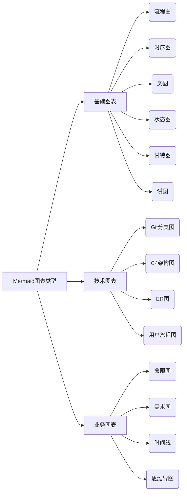
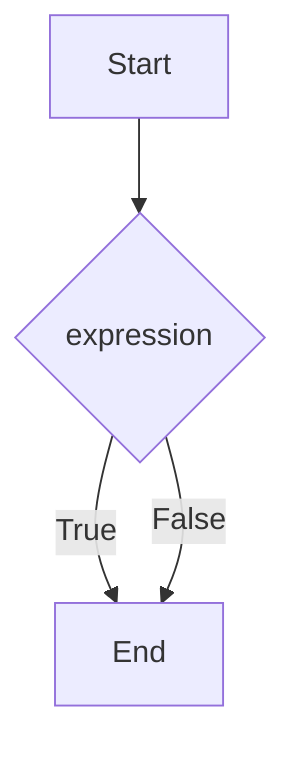
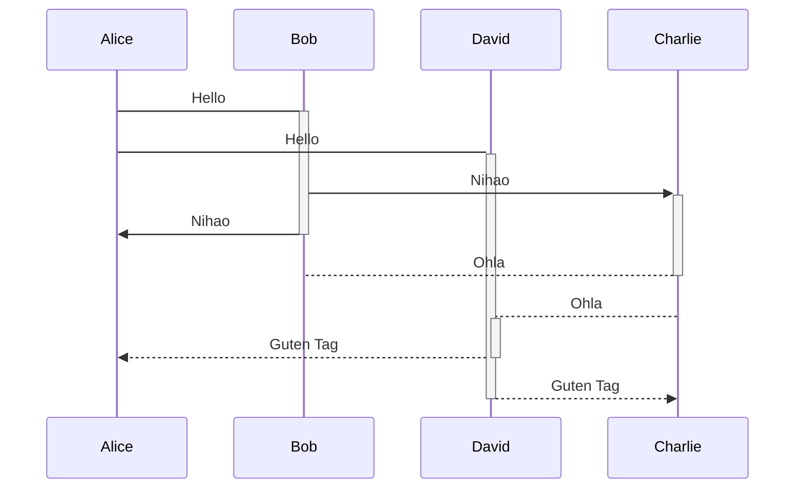
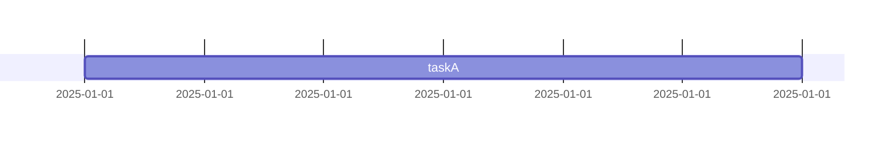

# Mermaid

## graph LR / graph TD

```mermaid
graph LR
    A[Mermaid图表类型] --> B[基础图表]
    A --> C[技术图表]
    A --> D[业务图表]
    
    B --> B1(流程图)
    B --> B2(时序图)
    B --> B3(类图)
    B --> B4(状态图)
    B --> B5(甘特图)
    B --> B6(饼图)
    
    C --> C1(Git分支图)
    C --> C2(C4架构图)
    C --> C3(ER图)
    C --> C4(用户旅程图)
    
    D --> D1(象限图)
    D --> D2(需求图)
    D --> D3(时间线)
    D --> D4(思维导图)
```

```mermaid
graph TD
    A[Start] --> B{expression}
    B -->|True| C[End]
    B -->|False| C
```

## sequenceDiagram

```mermaid
sequenceDiagram
    Alice ->+ Bob: Hello
    Alice ->+ David: Hello
    Bob ->>+ Charlie: Nihao
    Bob ->>- Alice:Nihao
    Charlie -->- Bob: Ohla
    Charlie -->+ David: Ohla
    David -->>- Alice: Guten Tag
    David -->>- Charlie: Guten Tag
```

## gantt

```mermaid
gantt
    taskA :a1, 2025-01-01, 30m
```
